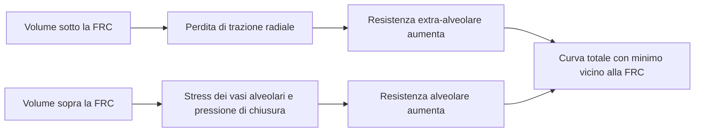

<!--
Arthur manual - representative editorial sample.

This page is intentionally more explicit than an ordinary model note: it is the
reference specimen for the future manual's voice, depth, internal-link pattern,
evidence labels, formulas, diagrams, code explanations and limitations. Links to
other manual pages are expected to become live as those pages are created.
-->

# Resistenza vascolare polmonare e curva a J

> **Stato della pagina:** campione editoriale per definire struttura e livello di approfondimento del manuale di **Arthur**. I collegamenti alle pagine non ancora scritte sono intenzionali: mostrano come funzionerà la navigazione ipertestuale.

La resistenza vascolare polmonare (PVR) varia con il volume polmonare. La rappresentazione classica è una curva a J o, più propriamente, a U asimmetrica: la resistenza è elevata vicino al volume residuo, raggiunge un minimo in prossimità della capacità funzionale residua (FRC) e aumenta di nuovo verso la capacità polmonare totale (TLC).

Arthur usa questa relazione per collegare la [meccanica polmonare](./meccanica-polmonare.md) al [postcarico del ventricolo destro](./postcarico-ventricolo-destro.md). La curva non è però una previsione paziente-specifica né una ricostruzione anatomica del letto vascolare: è una **mappa didattica semi-quantitativa** dei principali meccanismi che fanno variare il carico vascolare polmonare con il volume.

## In breve

- Sotto la FRC prevale la perdita di trazione radiale sui vasi extra-alveolari: riducendo ulteriormente il volume, la PVR aumenta.
- Sopra la FRC prevale progressivamente il carico sui vasi alveolari e l’aumento della pressione di chiusura: aumentando ulteriormente il volume, la PVR aumenta.
- La PVR minima vicino alla FRC è una sintesi fisiologica utile, non un punto universale e immutabile.
- Nel grafico di Arthur le due curve colorate sono componenti didattiche della via vascolare aperta; non sono due letti perfusionali indipendenti.
- La PVR calcolata al cateterismo e il coefficiente resistivo interno del modello possono differire. Arthur li espone separatamente.

## La costruzione fisiologica

La curva totale nasce dalla somma di due contributi con andamento opposto.

### Il braccio a basso volume

I vasi extra-alveolari sono immersi nel parenchima e vengono mantenuti pervi anche dalla trazione radiale esercitata dal polmone espanso. A bassi volumi questa trazione diminuisce: i vasi diventano più stretti e tortuosi e la loro conduttanza si riduce. *In vivo* possono sommarsi chiusura di unità alveolari, ipossia regionale e [vasocostrizione polmonare ipossica](./vasocostrizione-polmonare-ipossica.md).

Per questo motivo, partendo dal volume residuo e aumentando il volume verso la FRC, la resistenza tende a diminuire.

### Il braccio ad alto volume

Oltre la FRC il vantaggio ottenibile dal reclutamento e dalla distensione dei vasi extra-alveolari si esaurisce progressivamente. Diventano più rilevanti i vasi contenuti nelle pareti alveolari, esposti alle forze associate alla distensione polmonare e alla pressione alveolare. Se la pressione esterna al vaso supera la sua pressione a valle, il comportamento assomiglia a quello di un resistore di Starling: la pressione atriale sinistra non è più l’unico determinante della pressione a valle efficace.

Questa lettura, approfondita nella pagina su [zone di West e vascular waterfall](./zone-west-waterfall.md), è più precisa della semplice immagine di “capillari schiacciati”. Il risultato clinicamente rilevante rimane comunque lo stesso: a volumi elevati aumenta il carico contro cui il ventricolo destro deve eiettare.

### Perché il minimo è vicino alla FRC

Vicino alla FRC i due effetti sono relativamente bilanciati: la trazione radiale è sufficiente a mantenere aperti i vasi extra-alveolari, mentre la distensione delle unità aerate non è ancora tale da rendere dominante il braccio alveolare. La posizione esatta del minimo varia con pressione vascolare, flusso, storia di inflazione, reclutamento, tono vascolare e patologia.

Gli esperimenti classici hanno dimostrato in modo robusto la dipendenza dal volume e l’andamento bifasico, ma sono stati condotti soprattutto in cani anestetizzati o in polmoni/lobi isolati. Non esiste una curva umana *in vivo* con asse quantitativo capace di fissare universalmente forma, minimo e ampiezza da RV a TLC. Arthur colloca quindi il minimo vicino alla propria FRC di riferimento senza trattare le proporzioni ottenute nei preparati animali come target numerici umani.

## PVR misurata e carico vascolare reale

Al letto del paziente la PVR viene ricavata dalla relazione:

$$
\mathrm{PVR}_{\mathrm{derivata}}
= \frac{\mathrm{mPAP}-\mathrm{PAOP}}{\mathrm{CO}}
$$

dove mPAP è la pressione arteriosa polmonare media, PAOP la pressione di occlusione dell’arteria polmonare e CO la portata cardiaca. Il risultato è espresso in Wood units.

Questa formula è clinicamente utile, ma comprime in un singolo numero fenomeni diversi: calibro e tono vascolare, reclutamento e distensione dei vasi, ostruzione, viscosità, pressione di chiusura e dipendenza dal flusso. Presuppone inoltre una relazione pressione-flusso sufficientemente lineare e considera PAOP come pressione a valle. Tali assunzioni sono ragionevoli in molte condizioni cliniche, ma non descrivono tutta l’[impedenza polmonare](./postcarico-ventricolo-destro.md), soprattutto a flussi molto bassi o quando interviene un vascular waterfall.

> **Regola di lettura:** in Arthur la PVR è un indicatore aggregato del carico resistivo. Non va interpretata come misura isolata del calibro vascolare, né come descrizione completa del postcarico destro.

## Come leggere il grafico in Arthur

Il pannello **PVR vs lung volume** sovrappone una costruzione di riferimento e lo stato corrente del paziente simulato.

| Elemento | Significato | Da non confondere con |
|---|---|---|
| **Extra-alveolar vessels** | contributo meccanico a basso volume della via aperta | resistenza anatomica di tutte le arterie e vene extra-alveolari |
| **Alveolar vessels** | contributo meccanico che cresce ad alto volume | misura isolata della resistenza capillare |
| **Total PVR** | somma in serie dei due contributi nella via completamente aperta | PVR complessiva del paziente in presenza di dereclutamento e HPV |
| **Patient** | coefficiente resistivo istantaneo risultante dalle vie aperte e dereclutate | PVR ricavata dalle pressioni medie e dalla portata |
| **RV, FRC, TLC** | riferimenti volumetrici calcolati per il polmone impostato | valori universali per ogni adulto |

Le curve di riferimento vengono disegnate mantenendo virtualmente aperto tutto il polmone. In questo modo il grafico conserva il messaggio fisiologico dei due bracci anche durante scenari complessi. Il punto **Patient** reintroduce invece la frazione realmente aperta, il percorso vascolare delle unità dereclutate e la vasocostrizione ipossica.

La banda verticale indica l’escursione di volume del respiro corrente. Lo zoom modifica soltanto l’asse verticale: RV, FRC e TLC restano visibili, perché nascondere un’estremità della curva cambierebbe il significato didattico della figura.

## Come il concetto è implementato

Arthur riferisce il volume corrente al volume che lo stesso polmone avrebbe, se completamente aperto, alla pressione di recoil scelta come riferimento della FRC. La variabile interna è quindi la distensione per unità aperta, non il volume assoluto di un polmone sano:

$$
\varepsilon
= \frac{V_{L}}{\phi\,V_{\mathrm{FRC,open}}}-1
$$

dove $V_L$ è il volume polmonare, $\phi$ la frazione aperta e $V_{\mathrm{FRC,open}}$ il volume di riposo del tessuto completamente aperto. Questo evita che un “baby lung” rigido e piccolo venga classificato come sotto-disteso solo perché il suo volume totale è inferiore alla FRC normale.

Nella via aperta il modello usa:

- un termine alveolare che cresce gradualmente con la distensione;
- un termine extra-alveolare che diminuisce con l’espansione;
- un rinforzo non lineare del solo braccio a basso volume, per rendere visibile la perdita di trazione radiale vicino a RV.

I due termini si sommano **in serie** nella via aperta. Le vie delle unità aperte e dereclutate sono invece disposte **in parallelo**, per cui si sommano le loro conduttanze:

$$
G_{\mathrm{tot}}
= \frac{\phi}{R_{\mathrm{open}}}
+ \frac{1-\phi}{R_{\mathrm{closed}}},
\qquad
R_{\mathrm{tot}}=\frac{1}{G_{\mathrm{tot}}}
$$

La [vasocostrizione polmonare ipossica](./vasocostrizione-polmonare-ipossica.md) aumenta soltanto la resistenza della via dereclutata. Separatamente, il circuito applica il vascular waterfall alla quota alveolare del letto polmonare. Per questa ragione Arthur mostra sia il **model resistance coefficient**, usato nell’integrazione, sia la **derived PVR**, calcolata da pressioni medie e portata come avverrebbe con un catetere arterioso polmonare.

### Valori di riferimento del modello normale

Con i parametri predefiniti e polmone completamente aperto, la costruzione meccanica produce approssimativamente:

| Punto | Volume | Braccio alveolare | Braccio extra-alveolare | Somma della via aperta |
|---|---:|---:|---:|---:|
| RV | 1,31 L | 0,46 WU | 1,57 WU | 2,03 WU |
| FRC | 2,25 L | 0,58 WU | 0,58 WU | 1,17 WU |
| TLC | 6,00 L | 1,54 WU | 0,28 WU | 1,81 WU |

Questi valori documentano il comportamento del modello e ne rendono verificabili le revisioni. Non sono intervalli fisiologici normali da applicare al paziente.

## Perché Arthur usa questa soluzione

La scelta cerca un equilibrio fra leggibilità e plausibilità:

1. **Conserva i due bracci classici.** Sono immediatamente riconoscibili e collegano volume polmonare e postcarico destro.
2. **Usa il volume come variabile meccanica principale.** Negli studi sperimentali la relazione è risultata più stabile rispetto a quella con la sola pressione transpulmonare e meno dipendente dalla storia di inflazione.
3. **Centra il minimo sulla FRC del polmone simulato.** È coerente con la sintesi clinica corrente e non trasferisce nell’uomo la geometria numerica di polmoni canini isolati.
4. **Mantiene separati riferimento e paziente.** La curva completamente aperta spiega il meccanismo; il punto corrente mostra dereclutamento e HPV senza trasformare il grafico in un insieme illeggibile di curve regionali.
5. **Non scompone ogni determinante della PVR.** Ostruzione, viscosità e rimodellamento sono assorbiti nel carico vascolare aggregato. Una scomposizione più fine sarebbe analiticamente più precisa ma aggiungerebbe variabili poco osservabili senza migliorare l’obiettivo principale: capire l’interazione cuore-polmone.

L’uguaglianza dei due contributi alla FRC è quindi una **scelta grafica e modellistica**, non l’affermazione che metà della PVR umana risieda anatomicamente nei vasi alveolari.

## Cosa osservare negli scenari

La curva va letta insieme alle altre grandezze, non come pannello isolato.

- **ARDS poco reclutabile:** aumentando la [PEEP](./peep.md), il volume delle unità già aperte cresce più del letto disponibile; il punto tende verso il braccio destro e la PVR può aumentare.
- **ARDS più reclutabile:** una parte del volume aggiunto apre nuove unità e nuovi percorsi vascolari; l’aumento della PVR può essere attenuato. Il rapporto fra reclutamento e inflazione è descritto nella pagina sul [R/I ratio](./ri-ratio.md).
- **COPD con limitazione espiratoria:** l’iperinflazione dinamica sposta il volume operativo verso destra e può aumentare il postcarico destro; il meccanismo respiratorio è discusso in [EFL, auto-PEEP e iperinflazione](./efl-autopeep.md).
- **Embolia polmonare:** il modello aumenta il carico vascolare aggregato, con conseguente aumento di mPAP dipendente anche dalla portata e dalla capacità del ventricolo destro. Non rappresenta separatamente ostruzione, pressione critica di chiusura e tono vascolare.

Nello [scenario clinico](./scenari.md), osservare almeno PVR, mPAP, portata cardiaca, volume e pressione del ventricolo destro. Una variazione di PVR isolata non basta a descrivere l’effetto emodinamico della ventilazione.

## Limiti di interpretabilità

- La forma quantitativa dei due bracci non deriva da una singola curva umana *in vivo*; è una costruzione semi-quantitativa vincolata da principi fisiologici e controlli di plausibilità.
- I coefficienti che regolano le curve, la quota del waterfall e la resistenza della via dereclutata sono parametri didattici aggregati, non costanti anatomiche misurate.
- La visualizzazione non rappresenta gravità, eterogeneità regionale, distribuzione delle zone di West, viscosità, ipercapnia, rimodellamento vascolare o impedenza pulsatile completa.
- Il modello non ricostruisce una famiglia di curve pressione-flusso a portate differenti; di conseguenza non può distinguere in modo completo variazioni di calibro, reclutamento vascolare e pressione critica di chiusura.
- Il punto corrente è istantaneo, mentre la PVR da catetere usa pressioni e portata medie. Il confronto è informativo, non un test di equivalenza numerica battito per battito.
- Il minimo vicino alla FRC non implica che ogni paziente abbia la PVR minima alla propria FRC clinicamente misurata.
- Arthur è uno strumento didattico e non deve guidare impostazioni ventilatorie o decisioni terapeutiche individuali.

## Stato dell’evidenza

| Affermazione | Solidità | Uso in Arthur |
|---|---|---|
| La PVR aumenta sia a volumi molto bassi sia a volumi elevati | consolidata in fisiologia sperimentale | vincolo strutturale |
| A basso volume domina la perdita di supporto extra-alveolare | consolidata come meccanismo qualitativo | braccio sinistro |
| Ad alto volume aumentano pressione di chiusura e carico alveolare | consolidata come meccanismo qualitativo | braccio destro e waterfall |
| Il minimo cade esattamente alla FRC | sintesi utile, ma variabile fra preparazioni e condizioni | ancoraggio didattico |
| I due contributi sono uguali alla FRC | non misurato in modo univoco nell’uomo | scelta didattica esplicita |
| Le ampiezze numeriche RV/FRC/TLC sono universali | non dimostrato | non assunto |
| La risposta della PVR alla PEEP dipende dalla reclutabilità in ARDS | supportata da dati umani *in vivo* | controllo semi-quantitativo degli scenari ARDS |

## Pagine collegate

- [Pressioni transmurali](./pressioni-transmurali.md)
- [Zone di West e vascular waterfall](./zone-west-waterfall.md)
- [Postcarico del ventricolo destro](./postcarico-ventricolo-destro.md)
- [Reclutamento e R/I ratio](./ri-ratio.md)
- [PEEP](./peep.md)
- [Tempo di transito polmonare](./tempo-transito-polmonare.md)
- [Scenari clinici](./scenari.md)

## Bibliografia essenziale

### Fonti sperimentali

1. Thomas LJ Jr, Griffo ZJ, Roos A. Effect of negative-pressure inflation of the lung on pulmonary vascular resistance. *J Appl Physiol*. 1961;16:451-456. [doi:10.1152/jappl.1961.16.3.451](https://doi.org/10.1152/jappl.1961.16.3.451).
2. Simmons DH, Linde LM, Miller JH, O’Reilly RJ. Relation between lung volume and pulmonary vascular resistance. *Circ Res*. 1961;9:465-471. [doi:10.1161/01.RES.9.2.465](https://doi.org/10.1161/01.RES.9.2.465).
3. Hakim TS, Michel RP, Chang HK. Effect of lung inflation on pulmonary vascular resistance by arterial and venous occlusion. *J Appl Physiol*. 1982;53:1110-1115. [doi:10.1152/jappl.1982.53.5.1110](https://doi.org/10.1152/jappl.1982.53.5.1110).
4. Hughes JMB, Glazier JB, Maloney JE, West JB. Effect of lung volume on the distribution of pulmonary blood flow in man. *Respir Physiol*. 1968;4:58-72. [doi:10.1016/0034-5687(68)90007-8](https://doi.org/10.1016/0034-5687(68)90007-8).
5. Cappio Borlino S, Hagry J, Lai C, et al. The effect of positive end-expiratory pressure on pulmonary vascular resistance depends on lung recruitability in patients with acute respiratory distress syndrome. *Am J Respir Crit Care Med*. 2024;210:900-907. [doi:10.1164/rccm.202402-0383OC](https://doi.org/10.1164/rccm.202402-0383OC).

### Sintesi fisiologiche e cliniche

6. Kenny JE. *An Approach to Mechanical Heart-Lung Interaction*. 1st ed. Spectral Envelope Publishing House; 2020. In particolare capitoli 2-3. [Testo disponibile presso la Society of Mechanical Ventilation](https://societymechanicalventilation.org/wp-content/uploads/2022/10/Kenny-Approach-Heart-Lung-1stEd.pdf).
7. Cecconi M, Collino F, Pinsky MR. Heart-lung interactions in ARDS: practical bedside implications. *Intensive Care Med*. 2026. [doi:10.1007/s00134-026-08583-3](https://doi.org/10.1007/s00134-026-08583-3).
8. Mahmood SS, Pinsky MR. Heart-lung interactions during mechanical ventilation: the basics. *Ann Transl Med*. 2018;6:349. [doi:10.21037/atm.2018.04.29](https://doi.org/10.21037/atm.2018.04.29).
9. Yuriditsky E, Mireles-Cabodevila E, Alviar CL. How I teach: heart-lung interactions during mechanical ventilation. Positive pressure and the right ventricle. *ATS Scholar*. 2025;6:94-108. [doi:10.34197/ats-scholar.2024-0059HT](https://doi.org/10.34197/ats-scholar.2024-0059HT).

### Risorsa didattica complementare

- Yartsev A. Factors which affect pulmonary vascular resistance. *Deranged Physiology*. [Consultato il 12 agosto 2026](https://derangedphysiology.com/main/cicm-primary-exam/respiratory-system/Chapter-064/factors-which-affect-pulmonary-vascular-resistance).

---

**Arthur** — *ARTificial intelligence-built Heart-lUng Relationship model*. La documentazione descrive un modello didattico, non un dispositivo medico.
