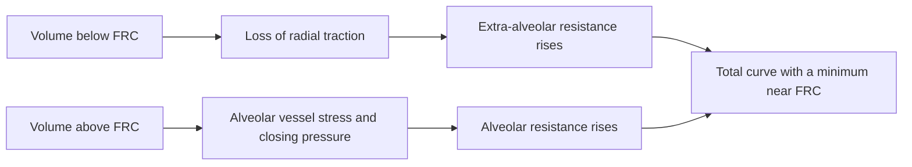

<!--
Arthur manual - representative editorial sample.

English is the canonical language for all reader-facing manual content.
This page is intentionally more explicit than an ordinary model note: it is the
reference specimen for the future manual's voice, depth, internal-link pattern,
evidence labels, formulas, diagrams, code explanations and limitations. Links to
other manual pages are expected to become live as those pages are created.
-->

# Pulmonary vascular resistance and the J-curve

> **Page status:** editorial sample used to define the structure and depth of the **Arthur** manual. Links to pages that have not yet been written are intentional: they demonstrate how the hypertext navigation will work.

Pulmonary vascular resistance (PVR) varies with lung volume. Its classical representation is a J-shaped or, more precisely, an asymmetrical U-shaped curve: resistance is high near residual volume, reaches a minimum around functional residual capacity (FRC), and rises again towards total lung capacity (TLC).

Arthur uses this relationship to connect [lung mechanics](./lung-mechanics.md) with [right ventricular afterload](./right-ventricular-afterload.md). The curve is neither a patient-specific prediction nor an anatomical reconstruction of the pulmonary vascular bed. It is a **semi-quantitative teaching map** of the main mechanisms through which lung volume changes pulmonary vascular load.

## In brief

- Below FRC, the loss of radial traction on extra-alveolar vessels predominates: further deflation increases PVR.
- Above FRC, the load on alveolar vessels and the effective closing pressure become progressively more important: further inflation increases PVR.
- A PVR minimum near FRC is a useful physiological synthesis, not a universal and immutable point.
- In Arthur's graph, the two coloured curves are teaching components of the open vascular pathway; they are not two independent perfusion beds.
- Catheter-derived PVR and the model's internal resistance coefficient may differ. Arthur reports them separately.

## The physiological construction

The total curve results from the sum of two components that move in opposite directions.

### The low-volume limb

Extra-alveolar vessels are embedded in the parenchyma and are kept open in part by the radial traction exerted by the expanded lung. At low volumes, this traction decreases: vessels become narrower and more tortuous, and their conductance falls. *In vivo*, airway and alveolar closure, regional hypoxia, and [hypoxic pulmonary vasoconstriction](./hypoxic-pulmonary-vasoconstriction.md) may add to this mechanical effect.

Consequently, as volume rises from residual volume towards FRC, resistance tends to fall.

### The high-volume limb

Above FRC, the benefit obtained from recruitment and distension of extra-alveolar vessels is progressively exhausted. Vessels contained within alveolar walls become more influential and are exposed to forces associated with lung distension and alveolar pressure. If the pressure outside a vessel exceeds its downstream pressure, the vessel behaves as a Starling resistor: left atrial pressure is no longer the sole determinant of effective downstream pressure.

This interpretation, developed further in [West zones and the vascular waterfall](./west-zones-vascular-waterfall.md), is more accurate than the simple image of “squashed capillaries”. The clinically relevant result is nevertheless the same: at high lung volumes, the load against which the right ventricle ejects increases.

### Why the minimum lies near FRC

Near FRC, the two effects are relatively balanced: radial traction is sufficient to support extra-alveolar vessels, while distension of aerated units is not yet sufficient for the alveolar limb to dominate. The exact position of the minimum varies with vascular pressure, flow, inflation history, recruitment, vascular tone, and disease.

Classical experiments robustly demonstrated volume dependence and a biphasic relationship, but most were performed in anaesthetised dogs or isolated lungs and lobes. No quantitative human *in vivo* curve can universally define the shape, minimum, and amplitude from RV to TLC. Arthur therefore places the minimum near its reference FRC without treating proportions measured in animal preparations as human numerical targets.

## Measured PVR and the actual vascular load

At the bedside, PVR is derived from:

$$
\mathrm{PVR}_{\mathrm{derived}}
= \frac{\mathrm{mPAP}-\mathrm{PAOP}}{\mathrm{CO}}
$$

where mPAP is mean pulmonary artery pressure, PAOP is pulmonary artery occlusion pressure, and CO is cardiac output. The result is expressed in Wood units.

This formula is clinically useful, but compresses several phenomena into a single number: vascular calibre and tone, vascular recruitment and distension, obstruction, viscosity, closing pressure, and flow dependence. It also assumes a sufficiently linear pressure-flow relationship and treats PAOP as the downstream pressure. These assumptions are reasonable in many clinical conditions but do not describe the entire [pulmonary vascular impedance](./right-ventricular-afterload.md), particularly at very low flow or when a vascular waterfall develops.

> **Interpretation rule:** in Arthur, PVR is an aggregate indicator of resistive load. It should not be read as an isolated measure of vascular calibre or as a complete description of right ventricular afterload.

## How to read the graph in Arthur

The **PVR vs lung volume** panel superimposes a reference construction and the current state of the simulated patient.

| Element | Meaning | Do not confuse it with |
|---|---|---|
| **Extra-alveolar vessels** | low-volume mechanical component of the open pathway | anatomical resistance of all extra-alveolar arteries and veins |
| **Alveolar vessels** | mechanical component that rises at high volume | an isolated measurement of capillary resistance |
| **Total PVR** | series sum of both components in the fully open pathway | the patient's total PVR in the presence of derecruitment and HPV |
| **Patient** | instantaneous resistance coefficient resulting from open and derecruited pathways | PVR derived from mean pressures and flow |
| **RV, FRC, TLC** | volume landmarks calculated for the configured lung | universal values for every adult |

The reference curves are drawn while the entire lung is held virtually open. This preserves the teaching message of the two limbs even in complex scenarios. The **Patient** point reintroduces the actual open fraction, the vascular pathway through derecruited units, and hypoxic pulmonary vasoconstriction.

The vertical band marks the volume excursion of the current breath. Zoom changes only the vertical axis: RV, FRC, and TLC remain visible because hiding one end of the curve would alter the teaching meaning of the figure.

## How the concept is implemented

Arthur relates current volume to the volume the same lung would have, if fully open, at the recoil pressure chosen as the FRC reference. The internal variable is therefore distension per open unit, rather than the absolute volume of a healthy lung:

$$
\varepsilon
= \frac{V_{L}}{\phi\,V_{\mathrm{FRC,open}}}-1
$$

where $V_L$ is lung volume, $\phi$ is the open fraction, and $V_{\mathrm{FRC,open}}$ is the resting volume of fully open tissue. This prevents a small, stiff “baby lung” from being classified as underinflated simply because its total volume is below normal FRC.

Within the open pathway, the model uses:

- an alveolar term that rises gradually with distension;
- an extra-alveolar term that falls with expansion;
- a nonlinear reinforcement of the low-volume limb alone, making the loss of radial traction near RV visible.

The two terms add **in series** within the open pathway. The pathways through open and derecruited units are arranged **in parallel**, so their conductances add:

$$
G_{\mathrm{tot}}
= \frac{\phi}{R_{\mathrm{open}}}
+ \frac{1-\phi}{R_{\mathrm{closed}}},
\qquad
R_{\mathrm{tot}}=\frac{1}{G_{\mathrm{tot}}}
$$

[Hypoxic pulmonary vasoconstriction](./hypoxic-pulmonary-vasoconstriction.md) raises resistance only in the derecruited pathway. Separately, the circulation applies the vascular waterfall to the alveolar share of the pulmonary bed. Arthur therefore displays both the **model resistance coefficient**, used by the integrator, and the **derived PVR**, calculated from mean pressures and flow as it would be with a pulmonary artery catheter.

### Reference values in the normal model

With default parameters and the lung held fully open, the mechanical construction produces approximately:

| Point | Volume | Alveolar limb | Extra-alveolar limb | Open-path sum |
|---|---:|---:|---:|---:|
| RV | 1.31 L | 0.46 WU | 1.57 WU | 2.03 WU |
| FRC | 2.25 L | 0.58 WU | 0.58 WU | 1.17 WU |
| TLC | 6.00 L | 1.54 WU | 0.28 WU | 1.81 WU |

These values document model behaviour and make subsequent revisions verifiable. They are not physiological reference ranges to apply to a patient.

## Why Arthur uses this solution

The design balances legibility and physiological plausibility:

1. **It preserves the two classical limbs.** They are immediately recognisable and connect lung volume with right ventricular afterload.
2. **It uses volume as the main mechanical variable.** In experimental studies, the relationship was more stable than the relationship with transpulmonary pressure alone and less dependent on inflation history.
3. **It centres the minimum on the simulated lung's FRC.** This agrees with current clinical synthesis and avoids importing the numerical geometry of isolated canine lungs into a human model.
4. **It separates the reference construction from the patient.** The fully open curve explains the mechanism; the current point shows derecruitment and HPV without turning the graph into an illegible collection of regional curves.
5. **It does not separate every determinant of PVR.** Obstruction, viscosity, and remodelling are absorbed into the aggregate vascular load. A finer decomposition would be analytically more precise but would add poorly observable variables without improving the main goal: understanding heart-lung interaction.

The equality of the two components at FRC is therefore a **graphical and modelling choice**, not a claim that half of human PVR is anatomically located in alveolar vessels.

## What to observe in the scenarios

The curve should be read together with other variables, not as an isolated panel.

- **Poorly recruitable ARDS:** as [PEEP](./peep.md) rises, the volume of already open units increases more than the available vascular bed; the patient point tends to move onto the right limb and PVR may rise.
- **More recruitable ARDS:** some of the added volume opens new units and vascular pathways, attenuating the rise in PVR. The balance between recruitment and inflation is described in [the R/I ratio](./ri-ratio.md).
- **COPD with expiratory flow limitation:** dynamic hyperinflation shifts operating volume to the right and may increase right ventricular afterload; the respiratory mechanism is discussed in [EFL, auto-PEEP, and hyperinflation](./efl-auto-peep.md).
- **Pulmonary embolism:** the model increases aggregate vascular load, producing an increase in mPAP that also depends on flow and right ventricular capacity. It does not represent obstruction, critical closing pressure, and vascular tone as separate mechanisms.

In the [clinical scenarios](./clinical-scenarios.md), observe at least PVR, mPAP, cardiac output, and right ventricular pressure and volume. A change in PVR alone is insufficient to describe the haemodynamic effect of ventilation.

## Limits of interpretation

- The quantitative shape of the two limbs does not derive from a single human *in vivo* curve. It is a semi-quantitative construction constrained by physiological principles and plausibility checks.
- The curve coefficients, waterfall fraction, and derecruited-pathway resistance are aggregate teaching parameters, not measured anatomical constants.
- The visualisation does not represent gravity, regional heterogeneity, the distribution of West zones, viscosity, hypercapnia, vascular remodelling, or complete pulsatile impedance.
- The model does not reconstruct a family of pressure-flow curves at different flows. It therefore cannot fully distinguish changes in calibre, vascular recruitment, and critical closing pressure.
- The current point is instantaneous, whereas catheter-derived PVR uses mean pressures and flow. Their comparison is informative, not a beat-by-beat numerical equivalence test.
- A minimum near FRC does not imply that every patient has minimum PVR at their clinically measured FRC.
- Arthur is an educational tool and must not guide individual ventilator settings or treatment decisions.

## State of the evidence

| Claim | Strength | Use in Arthur |
|---|---|---|
| PVR rises at both very low and high lung volumes | established in experimental physiology | structural constraint |
| Loss of extra-alveolar support dominates at low volume | established qualitative mechanism | left limb |
| Closing pressure and alveolar vascular load rise at high volume | established qualitative mechanism | right limb and waterfall |
| The minimum lies exactly at FRC | useful synthesis, but variable across preparations and conditions | teaching anchor |
| The two components are equal at FRC | not uniquely measured in humans | explicit teaching choice |
| Numerical RV/FRC/TLC amplitudes are universal | not demonstrated | not assumed |
| The PVR response to PEEP depends on recruitability in ARDS | supported by human *in vivo* data | semi-quantitative check of ARDS scenarios |

## Related pages

- [Transmural pressures](./transmural-pressures.md)
- [West zones and the vascular waterfall](./west-zones-vascular-waterfall.md)
- [Right ventricular afterload](./right-ventricular-afterload.md)
- [Recruitment and the R/I ratio](./ri-ratio.md)
- [PEEP](./peep.md)
- [Pulmonary transit time](./pulmonary-transit-time.md)
- [Clinical scenarios](./clinical-scenarios.md)

## Essential references

### Experimental sources

1. Thomas LJ Jr, Griffo ZJ, Roos A. Effect of negative-pressure inflation of the lung on pulmonary vascular resistance. *J Appl Physiol*. 1961;16:451-456. [doi:10.1152/jappl.1961.16.3.451](https://doi.org/10.1152/jappl.1961.16.3.451).
2. Simmons DH, Linde LM, Miller JH, O'Reilly RJ. Relation between lung volume and pulmonary vascular resistance. *Circ Res*. 1961;9:465-471. [doi:10.1161/01.RES.9.2.465](https://doi.org/10.1161/01.RES.9.2.465).
3. Hakim TS, Michel RP, Chang HK. Effect of lung inflation on pulmonary vascular resistance by arterial and venous occlusion. *J Appl Physiol*. 1982;53:1110-1115. [doi:10.1152/jappl.1982.53.5.1110](https://doi.org/10.1152/jappl.1982.53.5.1110).
4. Hughes JMB, Glazier JB, Maloney JE, West JB. Effect of lung volume on the distribution of pulmonary blood flow in man. *Respir Physiol*. 1968;4:58-72. [doi:10.1016/0034-5687(68)90007-8](https://doi.org/10.1016/0034-5687(68)90007-8).
5. Cappio Borlino S, Hagry J, Lai C, et al. The effect of positive end-expiratory pressure on pulmonary vascular resistance depends on lung recruitability in patients with acute respiratory distress syndrome. *Am J Respir Crit Care Med*. 2024;210:900-907. [doi:10.1164/rccm.202402-0383OC](https://doi.org/10.1164/rccm.202402-0383OC).

### Physiological and clinical syntheses

6. Kenny JE. *An Approach to Mechanical Heart-Lung Interaction*. 1st ed. Spectral Envelope Publishing House; 2020. See particularly chapters 2-3. [Text available from the Society of Mechanical Ventilation](https://societymechanicalventilation.org/wp-content/uploads/2022/10/Kenny-Approach-Heart-Lung-1stEd.pdf).
7. Cecconi M, Collino F, Pinsky MR. Heart-lung interactions in ARDS: practical bedside implications. *Intensive Care Med*. 2026. [doi:10.1007/s00134-026-08583-3](https://doi.org/10.1007/s00134-026-08583-3).
8. Mahmood SS, Pinsky MR. Heart-lung interactions during mechanical ventilation: the basics. *Ann Transl Med*. 2018;6:349. [doi:10.21037/atm.2018.04.29](https://doi.org/10.21037/atm.2018.04.29).
9. Yuriditsky E, Mireles-Cabodevila E, Alviar CL. How I teach: heart-lung interactions during mechanical ventilation. Positive pressure and the right ventricle. *ATS Scholar*. 2025;6:94-108. [doi:10.34197/ats-scholar.2024-0059HT](https://doi.org/10.34197/ats-scholar.2024-0059HT).

### Complementary teaching resource

- Yartsev A. Factors which affect pulmonary vascular resistance. *Deranged Physiology*. [Accessed 12 August 2026](https://derangedphysiology.com/main/cicm-primary-exam/respiratory-system/Chapter-064/factors-which-affect-pulmonary-vascular-resistance).

---

**Arthur** - *ARTificial intelligence-built Heart-lUng Relationship model*. This documentation describes an educational model, not a medical device.
