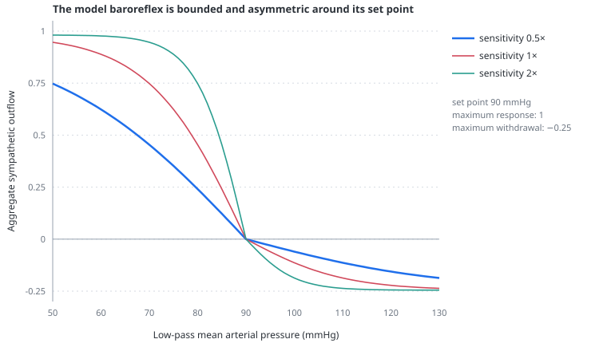

# Baroreflex

> The model contains one slow, bounded compensator that defends systemic arterial pressure by moving heart rate, vascular resistance, venous tone and contractility together; it is not a model of human beat-to-beat autonomic physiology.

---

## Physiology

Arterial baroreceptors respond to stretch in the carotid sinus and aortic arch. A fall in arterial pressure reduces afferent firing, withdraws vagal activity and increases sympathetic outflow. Heart rate and contractility rise, resistance vessels constrict, and capacitance vessels mobilise [stressed volume](stressed-volume.md). A rise in pressure produces the opposite response.

The reflex is most important for short-term buffering. It can make MAP look relatively stable while cardiac output, filling and vascular resistance change substantially. Conversely, an observed tachycardia or vasoconstriction is not evidence that the baroreflex was triggered by a specific pulmonary event. In the model, raised pulmonary vascular resistance, mPAP or right-ventricular distension can activate the compensator only if their downstream effects lower systemic arterial pressure; hypoxaemia has no separate chemoreflex route.

Real baroreflex physiology is not one signal. Cardiac vagal responses can occur within a beat, sympathetic effects are slower, and chronotropy, arteriolar resistance, venous capacitance and inotropy have different transfer functions. Disease, age, anaesthesia and vasoactive drugs alter both set point and gain.

---

## In the model

The `Baroreflex` checkbox is **off by default**. In that state the outflow is forced to zero, so a ventilatory intervention exposes the uncompensated mechanical interaction. This is a teaching reference state, not a claim that a healthy patient lacks autonomic regulation. Turning the checkbox on adds the model's aggregate pressure defence without changing the selected patient inputs.

The afferent signal is a low-pass mean arterial pressure, not pulsatile vessel-wall stretch. The difference between the selected set point and that mean pressure enters a saturating response. The retained `Baroreflex sensitivity` control changes how much pressure error is needed to approach the bound; it does not increase the maximum response. Sensitivity and set point remain visible but inactive while the checkbox is off, so an off/on comparison preserves their selected values.

Positive outflow is bounded at 1. Withdrawal is deliberately smaller and bounded at −0.25, reflecting low resting sympathetic tone and preventing a modest pressure excess from producing extreme bradycardia. The active outflow approaches its target with one 15-second time constant.

At full positive outflow, all four model effectors change together:

| effector | maximum model change |
|---|---:|
| heart rate | +42/min |
| systemic vascular resistance | +45% |
| volume shifted from unstressed to stressed | +200 mL |
| LV and RV end-systolic elastance | +30% |

These are didactic aggregate coefficients. They preserve a readable compensatory response across the control space; they are not fitted human gains and should not be compared with an autonomic function test.

The heart-rate control is the **baseline rate** selected for the phenotype. When the reflex is active, the circulation uses

$$
HR_{effective}=HR_{baseline}+42\times outflow
$$

The Heart rate tile displays this effective rate and states the baseline and reflex contribution underneath. The systemic-resistance tile follows the same rule: its main number is the effective SVR used by the circulation, while its subtitle separates the selected baseline from the reflex percentage change. The controls therefore remain inputs; they are not rewritten every time the compensator moves.

The septic preset illustrates the difference. The model remains preload responsive with the compensator either off or on: pressure defence does not manufacture volume or remove the underlying circulation problem. The current numerical comparison is generated rather than copied into the page.

<!-- BEGIN GENERATED: baroreflex-septic -->
*Executable septic-preset output after 45 s of settling; the two rows change the baroreflex switch only.*

| aggregate baroreflex | cardiac output (L/min) | MAP (mmHg) | effective heart rate (/min) | effective SVR (mmHg·s/mL) |
|---|---:|---:|---:|---:|
| off | 4.21 | 66.9 | 105 | 0.85 |
| on | 4.50 | 82.1 | 120 | 0.99 |
<!-- END GENERATED: baroreflex-septic -->

---

## Why this and not something else

With no compensation, every respiratory intervention is applied to an idealised autonomically unopposed preparation and its mechanical effect is easier to see. That is why off is the interface default. It can exaggerate the systemic cost relative to an intact patient, so turning the reflex on is the second step when asking how much of the disturbance remains after aggregate pressure defence. A complete autonomic model would require separate vagal and sympathetic pathways, afferent pulsatility, central integration, effector-specific delays, reset during chronic pressure changes and interactions with chemoreflexes and drugs.

One bounded state was chosen because the relevant teaching question is narrower: how much of an immediate mechanical disturbance remains visible after a plausible aggregate pressure defence? A shared state also keeps it clear that the readout is compensation, not a diagnosis of autonomic activity.

An additive heart-rate reserve is used instead of multiplying the selected baseline rate. A proportional response previously counted pre-existing tachycardia twice and could drive an already tachycardic phenotype above 350/min.

---

## Limits

### Of the construction

- The receptor signal is low-pass MAP rather than arterial stretch, pulse pressure or firing rate.
- There is one 15-second time constant for effectors that have different human latencies.
- Vagal and sympathetic cardiac actions are not separated.
- There is no chemoreflex, cardiopulmonary baroreflex, Bainbridge reflex, endocrine response or central command.
- The set point does not reset with chronic hypertension or prolonged shock.
- There is no coronary circulation, so defending systemic pressure cannot improve RV or LV perfusion directly.
- Presets may already contain selected tachycardia, resistance and filling that represent prior compensation; the reflex acts on top of that phenotype.

### Of clinical application

- The transient response cannot be used to infer a patient's baroreflex latency, sensitivity or autonomic reserve.
- The model cannot predict the response to beta-blockade, atropine, pacing, vasopressors or inotropes.
- Absence of a reflex response after isolated PVR or mPAP elevation is expected unless systemic MAP falls; it is not a statement that the clinical event is autonomically silent.

---

## Validation

Executable checks require the reflex to be off by default, defend MAP by increasing effective heart rate and systemic resistance when enabled, mobilise volume without adding blood, withdraw rather than reverse above the set point, remain bounded at high sensitivity, avoid multiplying an already high selected heart rate, and settle without oscillation. The off switch must override a retained non-zero sensitivity immediately; zero sensitivity must also restore the uncompensated model when the switch is on.

---

## References

- Eckberg DL, Sleight P. *Human Baroreflexes in Health and Disease*. Oxford: Clarendon Press; 1992. [doi:10.1093/oso/9780198576938.001.0001](https://doi.org/10.1093/oso/9780198576938.001.0001)
- Chapleau MW, Abboud FM. Determinants of sensitization of carotid baroreceptors by pulsatile pressure in dogs. *Circ Res*. 1989;65:566–577. [doi:10.1161/01.RES.65.3.566](https://doi.org/10.1161/01.RES.65.3.566)
- Skrapari I, Tentolouris N, Katsilambros N. Baroreflex function: determinants in healthy subjects and disturbances in diabetes, obesity and metabolic syndrome. *Curr Diabetes Rev*. 2006;2:329–338. [doi:10.2174/157339906777950589](https://doi.org/10.2174/157339906777950589)
- Persichini R, Lai C, Teboul JL, et al. Venous return and mean systemic filling pressure: physiology and clinical applications. *Crit Care*. 2022;26:150. [doi:10.1186/s13054-022-04024-x](https://doi.org/10.1186/s13054-022-04024-x)

---

## See also

[Venous tone](venous-tone.md) · [Stressed volume](stressed-volume.md) · [Venous return](venous-return.md) · [Controls: heart](controls-heart.md) · [Clinical scenarios](scenarios.md)
