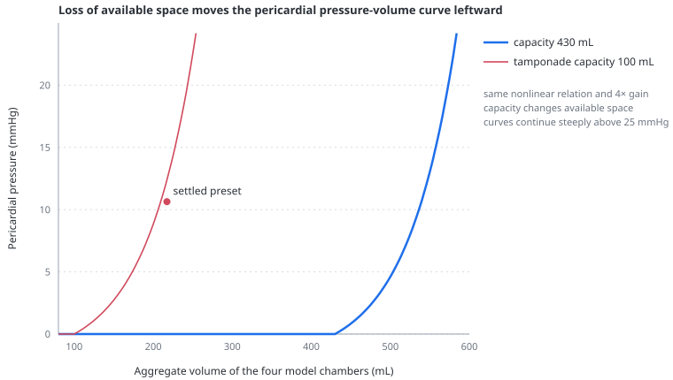

# Cardiac tamponade

> Tamponade is not defined by the size of an effusion. It occurs when pressure inside the pericardial sac restricts cardiac filling enough to reduce output; the heart and lungs interact because respiration redistributes filling between two ventricles competing for the same limited space.

---

## Physiology

The normal pericardium accommodates ordinary changes in cardiac volume with little pressure rise. Once its reserve is exhausted, however, the pressure–volume relation becomes very steep. This is why rapidly accumulating blood can cause tamponade at a much smaller volume than a slowly accumulating effusion, and why removing a relatively small first volume can produce a large haemodynamic improvement. The clinically important variable is therefore **pressure relative to available pericardial reserve**, not effusion volume alone.

Raised pericardial pressure is added to pleural pressure around all four chambers. Intracavitary filling pressures can consequently rise while the [transmural pressure](transmural-pressure.md) that actually distends a chamber approaches zero. Because the right atrium and right ventricle normally operate at lower pressures, they are usually affected first. Exact right- and left-sided pressure equality is not mandatory, but right atrial pressure, RV end-diastolic pressure, pulmonary artery diastolic pressure and PAWP commonly converge within a narrow range in classic tamponade.

The fixed-space constraint also exaggerates [ventricular interdependence](ventricular-interdependence.md). During spontaneous inspiration, systemic venous return favours the right heart. A normal pericardium can accept part of the extra volume; a tense one cannot, so right-sided filling occurs at the expense of left-sided filling. LV stroke volume and systolic arterial pressure then fall during inspiration. A fall in systolic pressure of at least 10 mmHg is conventionally called **pulsus paradoxus**, but it is neither unique to tamponade nor invariably present in it.

Positive-pressure ventilation is especially hazardous in a preload-limited tamponade phenotype because it can further impede systemic venous return. The simulator can be used to explore that direction, but urgent drainage—not ventilator titration—is definitive treatment in clinical tamponade.

## In the model

The four chambers share one external pericardial pressure. Their summed volume is

$$
V_{heart}=V_{ra}+V_{rv}+V_{la}+V_{lv}.
$$

When this volume exceeds the selected pericardial capacity, pressure rises exponentially:

$$
P_{peri}=
\begin{cases}
0, & V_{heart}\le C_{peri}\\[4pt]
k_{peri}\,0.55\left[e^{(V_{heart}-C_{peri})/62}-1\right], & V_{heart}>C_{peri}.
\end{cases}
$$

- $C_{peri}$ is **pericardial capacity**, the aggregate four-chamber volume accommodated before pressure rises;
- $k_{peri}$ is the dimensionless **pericardial constraint** gain;
- $P_{peri}$ is added to pleural pressure around both atria and both ventricles.

This is one shared constraint, not four independent chamber stiffnesses. Filling any chamber raises the external pressure experienced by all of them. The RV becomes especially vulnerable without a separate RV-specific rule because its available filling pressure is lower.

The figure is generated by the same `pericardialPressure()` function used by the circulation. Reducing capacity moves the knee of the relation leftward; it does not change the amount of blood in the circulation or myocardial stiffness.

### What the scenario shows

The **Cardiac tamponade** preset represents a compensated, spontaneously breathing phenotype. It reduces model pericardial capacity while leaving the nonlinear relation itself intact. Increasing capacity to 430 mL is the teaching analogue of decompression.

<!-- BEGIN GENERATED: cardiac-tamponade -->
*Executable setup: spontaneous breathing, inspiratory effort 10 cmH₂O, 20 breaths/min, selected heart rate 105/min, stressed volume 1,050 mL and pericardial gain 4×; each state is settled for 45 s. The second row changes pericardial capacity only.*

| state | capacity (mL) | Pperi (mmHg) | CVP (mmHg) | RV end-diastolic pressure (mmHg) | PA diastolic (mmHg) | wedge surrogate (mmHg) |
|---|---:|---:|---:|---:|---:|---:|
| constrained preset | 100 | 10.6 | 7.7 | 9.8 | 13.8 | 11.4 |
| capacity restored | 430 | 0.1 | -0.4 | 1.1 | 15.7 | 11.4 |

| state | RV EDV (mL) | LV EDV (mL) | cardiac output (L/min) | MAP (mmHg) |
|---|---:|---:|---:|---:|
| constrained preset | 74 | 98 | 4.10 | 89.0 |
| capacity restored | 138 | 148 | 6.37 | 112.7 |
<!-- END GENERATED: cardiac-tamponade -->

The constrained state brings the four clinically compared diastolic pressures into the same broad range, markedly reduces both ventricular end-diastolic volumes and depresses flow. Restoring capacity lowers pericardial pressure and CVP while RV filling recovers proportionally more than LV filling. This preferential RV effect emerges from the shared pressure acting on a lower-pressure chamber; it is not scripted into the scenario.

The pressure comparison is deliberately approximate. CVP and the wedge surrogate are three-second means, whereas RV end-diastolic and pulmonary artery diastolic pressure come from the latest completed beat. The table is sufficient to test convergence, not to reproduce a catheter tracing.

## Why capacity and not effusion volume

A literal effusion-volume slider would be easier to recognise but physiologically misleading. The same 200 mL can be catastrophic when accumulated rapidly and well tolerated when accumulated slowly; chronic effusions can reach far larger volumes before tamponade. The model therefore controls **space still available to the chambers**, which collapses accumulation rate, pericardial distensibility and fluid volume into one transparent teaching variable.

No fluid compartment is added, and changing capacity does not add or remove circulating blood. This keeps the intervention mechanistic and computationally small while preserving the central pressure–volume relation.

The scenario is also not forced to meet a numerical diagnostic threshold. It must show high pericardial pressure, convergence of diastolic pressures, preferential restriction of RV filling, depressed output and improvement with restored capacity. Those are executable directional contracts. Absolute pressure, output and volume changes are illustrative.

## What the model does not reproduce

- **Pulsus paradoxus is not quantitatively calibrated.** Respiratory arterial variation increases in the constrained state, but the preset is not required to cross the clinical 10 mmHg threshold. The existing PPV tile is unavailable during spontaneous breathing and must not be repurposed as a pulsus-paradoxus measurement.
- There is no pericardial fluid compartment, accumulation rate, drainage flow or loculated effusion. Capacity is an aggregate surrogate, not an echocardiographic volume.
- Right atrial and right ventricular wall collapse are not represented geometrically. The thorax panel shows pressure and chamber volume, not diagnostic echocardiographic signs.
- There is no inferior-vena-cava plethora measurement, Doppler inflow variation, electrical alternans or ECG.
- Coronary perfusion, myocardial ischaemia and the effect of falling arterial pressure on RV performance are absent.
- The model does not represent low-pressure tamponade, regional postoperative tamponade, severe pulmonary hypertension masking right-sided collapse, constrictive or effusive–constrictive pericarditis.
- Autonomic compensation senses filtered systemic MAP only. It does not respond directly to pericardial pressure, chamber stretch or venous congestion.

The preset can therefore teach why a shared external pressure restricts filling and why decompression restores flow. It cannot diagnose tamponade, grade severity, estimate the volume to drain or predict an individual's response to intubation or fluid.

## References

- Schulz-Menger J, Collini V, Gröschel J, et al. 2025 ESC Guidelines for the management of myocarditis and pericarditis. *Eur Heart J*. 2025;46:3952–4041. [doi:10.1093/eurheartj/ehaf192](https://doi.org/10.1093/eurheartj/ehaf192)
- Reddy PS, Curtiss EI, Uretsky BF. Spectrum of hemodynamic changes in cardiac tamponade. *Am J Cardiol*. 1990;66:1487–1491.
- Reddy PS, Curtiss EI, O'Toole JD, et al. Cardiac tamponade: hemodynamic observations in man. *Circulation*. 1978;58:265–272. [PubMed](https://pubmed.ncbi.nlm.nih.gov/668074/)
- Appleton CP, Hatle LK, Popp RL. Cardiac tamponade and pericardial effusion: respiratory variation in transvalvular flow velocities studied by Doppler echocardiography. *J Am Coll Cardiol*. 1988;11:1020–1030.
- Hamzaoui O, Monnet X, Teboul JL. Pulsus paradoxus. *Eur Respir J*. 2013;42:1696–1705. [doi:10.1183/09031936.00138912](https://doi.org/10.1183/09031936.00138912)
- Tyberg JV, Misbach GA, Glantz SA, Moores WY, Parmley WW. A mechanism for shifts in the diastolic left ventricular pressure–volume curve: the role of the pericardium. *Eur J Cardiol*. 1978;7 Suppl:163–175. [PubMed](https://pubmed.ncbi.nlm.nih.gov/668760/)

---

## See also

[Ventricular interdependence](ventricular-interdependence.md) · [Transmural pressure](transmural-pressure.md) · [The right ventricle](the-right-ventricle.md) · [Pulmonary artery wedge pressure](pulmonary-artery-wedge-pressure.md) · [Clinical scenarios](scenarios.md) · [Heart controls](controls-heart.md) · [Global limits](global-limits.md)
