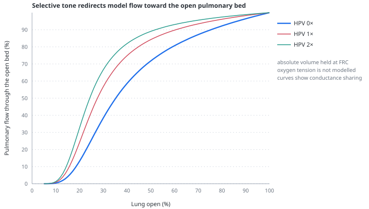

# Hypoxic pulmonary vasoconstriction

> Hypoxic pulmonary vasoconstriction redirects blood away from poorly ventilated lung, but the model represents this as selective tone in derecruited units rather than as an oxygen-driven regional response.

---

## Physiology

Systemic arteries dilate in local hypoxia; small pulmonary arteries do the opposite. A fall in alveolar oxygen tension constricts vessels supplying that region and can divert perfusion toward better ventilated lung. This local response improves ventilation–perfusion matching when hypoxia is patchy.

The same mechanism has a cost. If hypoxia is widespread, vasoconstriction acts across much of the pulmonary circulation and raises right ventricular afterload. Its net effect therefore depends on how much lung is involved, the remaining recruitable vascular bed, pulmonary arterial and venous pressure, cardiac output, mixed venous oxygen tension, carbon dioxide, pH and time.

HPV is neither an on/off switch nor a direct function of macroscopic lung collapse. Aerated units can be hypoxic, derecruited units can receive little flow, and vascular obstruction can raise PVR without hypoxia. Recruitment may improve oxygenation and restore vascular area, but overdistension can simultaneously compress alveolar vessels.

## In the model

The pulmonary bed is divided into open and derecruited pathways in parallel. Their conductances add:

$$
G_{pul} = \frac{\phi}{R_{open}} + \frac{1-\phi}{R_{closed}}
$$

- $G_{pul}$ — total pulmonary conductance, the reciprocal of resistance
- $\phi$ — fraction of represented lung currently open, from 0 to 1
- $R_{open}$ — resistance of the open pathway, including alveolar and extra-alveolar vessel components
- $R_{closed}$ — resistance assigned to the derecruited pathway

The HPV control raises $R_{closed}$ only. This reduces the share of flow through derecruited lung and can redirect flow toward the open pathway. Because closed units are not removed entirely, severe collapse can still reduce total conductance and increase RV load.

The graph holds absolute lung volume at the model's vascular FRC and varies only the open fraction and HPV setting. At any partially open state, stronger selective tone sends a larger share of total flow through the open pathway. This is an exact graph of the model conductances; it is not a human dose–response curve and says nothing about oxygenation.

There is no alveolar or arterial oxygen tension in the model. The control therefore means **the strength of a selective vascular response associated with derecruited lung**, not a calculation of biological HPV from oxygen. Its gain and the baseline closed-path resistance are didactic shape coefficients.

## Why this and not something else

A global multiplier on PVR would show the RV cost of vasoconstriction but not its local purpose—redistributing flow. Two parallel pathways preserve that distinction with one control and without adding gas exchange or dozens of lung regions.

A mechanistic oxygen-sensing model was not added because it would require regional ventilation, perfusion, shunt, oxygen content, mixed venous oxygen, acid–base state and vascular response kinetics. Those variables would turn the application toward gas-exchange physiology while its central subject is heart–lung interaction.

## Limits

### Of the construction

- Derecruitment is used as the trigger surrogate; alveolar oxygen tension is not computed.
- There is one open and one closed pathway, with no gravitational or regional distribution.
- The model has no gas exchange, shunt fraction, dead space, mixed venous oxygen, hypercapnia, acidosis, endothelial mediators or time-dependent HPV response.
- The vasoconstrictor response changes resistance but does not alter vascular compliance or pulsatile impedance.
- HPV and the open fraction are user-visible model states, not quantities measured directly at the bedside.

### Of clinical application

- Changing the HPV slider cannot predict oxygenation, pulmonary artery pressure or response to inhaled pulmonary vasodilators in a patient.
- A high derived PVR does not identify HPV as its cause; obstruction, low flow, pressure-dependent vessel calibre and elevated downstream pressure remain alternatives.
- The robust teaching claim is qualitative: selective constriction can improve perfusion matching locally while increasing global RV load when it involves a large vascular territory.

## Validation

Executable checks require stronger HPV to reduce relative flow through the derecruited pathway, stronger collapse to reduce available pulmonary conductance, and total PVR to remain the parallel combination of open and closed beds. These are internal mechanism checks, not validation against measured regional human perfusion.

## References

- Sylvester JT, Shimoda LA, Aaronson PI, Ward JPT. Hypoxic pulmonary vasoconstriction. *Physiol Rev*. 2012;92:367–520. [doi:10.1152/physrev.00041.2010](https://doi.org/10.1152/physrev.00041.2010)
- Dunham-Snary KJ, Wu D, Sykes EA, et al. Hypoxic pulmonary vasoconstriction: from molecular mechanisms to medicine. *Chest*. 2017;151:181–192. [doi:10.1016/j.chest.2016.09.001](https://doi.org/10.1016/j.chest.2016.09.001)
- Marshall BE, Marshall C, Frasch F, Hanson CW. Role of hypoxic pulmonary vasoconstriction in pulmonary gas exchange and blood flow distribution. *Intensive Care Med*. 1994;20:291–297. [doi:10.1007/BF01708967](https://doi.org/10.1007/BF01708967)

---

## See also

[Pulmonary vascular resistance](pulmonary-vascular-resistance.md) · [The two-population lung](two-population-lung.md) · [Recruitment and R/I](recruitment-and-ri.md) · [The right ventricle](the-right-ventricle.md) · [Global limits](global-limits.md)
