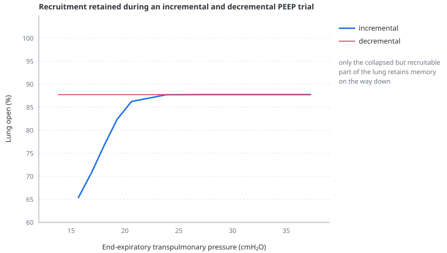

# Recruitment-state hysteresis

> Optional. A unit that needed a high pressure to open does not close again until pressure falls much further, so the lung's state depends on where it has been. The model represents recruitment and derecruitment hysteresis only — not the hysteresis of the tissue itself.

---

## Physiology

Opening a collapsed lung unit and keeping it open are different problems. Opening one requires overcoming surface forces at a closed air–liquid interface, which takes a substantial pressure. Once open, the interface no longer exists and the unit stays open at a far lower pressure.

The consequence is that both aerated volume and recruitment state at a given pressure can depend on history. A classical respiratory pressure–volume loop contains this opening-and-closing component together with surfactant, tissue viscoelasticity and time-dependent effects.

This is the entire rationale for a recruitment manoeuvre followed by a decremental PEEP trial. The manoeuvre is transient and by itself achieves nothing lasting; what makes it worth doing is that afterwards the lung can be **held** open at a PEEP below the pressure that opened it.

And it follows immediately that the manoeuvre's value is decided by what comes after it. If the pressure the lung is left at falls below the closing pressure, the units shut again and the manoeuvre has bought nothing but a haemodynamic insult.

---

## In the model

Hysteresis is off by default. Enabled, it adds two controls: `pOpen`, the transpulmonary pressure at which units open, and `pClose`, the transpulmonary pressure below which they close again. **Both are transpulmonary pressures, not airway pressures and not PEEP.**

At any pressure the model computes two open fractions rather than one:

$$
\varphi_{lo} = \varphi(P_l \mid P_{open}), \qquad \varphi_{hi} = \varphi(P_l \mid P_{close})
$$

- $\varphi_{lo}$ — the fraction that this pressure can open, using the opening threshold
- $\varphi_{hi}$ — the fraction this pressure can keep open, using the lower closing threshold
- $P_l$ — transpulmonary pressure, cmH₂O

These are the edges of a band. The lung's actual open fraction is a **state** carried between time steps, and a play operator clamps it into the band:

```
phi = min(max(phi, lo), hi)
```

It moves only when the state has become incompatible with the present pressure. Rising pressure that exceeds what the state can justify drags it up to the inflation limb; falling pressure that goes below the closing region drags it down to the deflation limb. Between the two the state does not move, and the lung remembers.

Because the open fraction is a state rather than a function of the present pressure, the mechanics and the [pulmonary vascular resistance](pulmonary-vascular-resistance.md) must be read off that state rather than recomputed from pressure. Both code paths accept a known open fraction for exactly this reason.

### A reproducible experiment

A recruitable ARDS lung, volume control at 250 mL and 20 breaths per minute, `clung` 45, `collapsed` 0.45, R/I 0.6, `pOpen` 22, `pClose` 6. Settle at PEEP 10, raise PEEP to 35 for 30 s, return to PEEP 10:

| | before | after |
|---|---|---|
| lung open | 80.3% | **96.2%** |
| pulmonary resistance coefficient | 1.41 WU | 1.21 WU |

Nearly sixteen percentage points of lung stay open at the same PEEP the patient started on, and the right ventricle feels it.

Walking the same preparation up and back down in PEEP steps, with the state carried continuously, gives two **recruitment-state** limbs:



| end-expiratory P<sub>l</sub> | incremental | decremental |
|---|---|---|
| ~9 cmH₂O | 70.1% | **87.6%** |
| ~11 | 75.0 | 92.7 |
| ~12 | 80.3 | 96.2 |
| ~15 | 90.4 | 99.2 |
| ~21 | 99.6 | 100.0 |
| >24 | 100.0 | 100.0 |

The limbs converge at the top, where pressure has opened everything that can open, and separate below it. The figure is plotted against **end-expiratory transpulmonary pressure** and its vertical axis is **open fraction**, not lung volume. It is therefore not the classical inflation–deflation pressure–volume loop. `pClose` is defined as a transpulmonary pressure, and the same PEEP produces different transpulmonary pressures depending on chest wall, lung volume and how much lung is open.

### When the manoeuvre leaves nothing

Three conditions, each sufficient on its own, and each clinically real.

**The pressure afterwards is below the closing pressure.** With `pClose` raised to 14 against an end-expiratory transpulmonary pressure of 12.7, the same manoeuvre retains 0.0 points. The lung passes back through the closing region on every expiration and shuts.

**The breath is already large enough to recruit by itself.** At 400 mL instead of 250, the same manoeuvre retains 2.3 points instead of 15.9. Each ordinary breath already reaches the opening limb, so there is nothing left for a manoeuvre to add — and the tidal opening and closing that implies is itself injurious.

**The lung is not recruitable.** With little openable compartment there is nothing to hold, whatever the pressures.

---

## Why this and not something else

**A play operator rather than a recruitment-manoeuvre button.** The alternative design was a button that performed a manoeuvre and set a flag. It was rejected because it makes recruitment an event with a scripted consequence, and the interesting behaviour — that the same manoeuvre helps or does nothing depending on what follows it — would have been written into the script rather than emerging. The three conditions above are not coded anywhere; they fall out of a band and a state.

**Off by default.** Path dependence means the model's state depends on its history, so two identical control settings can give different answers. That is physiologically right and pedagogically confusing, so it is opt-in, and `pClose` stays greyed out until it is enabled.

**A state band rather than a pressure–volume loop model.** Real respiratory hysteresis is continuous and has an area. This feature uses two shifted recruitment distributions to create a band; it represents the memory relevant to an incremental/decremental trial, not the area or shape of a measured pressure–volume loop.

**Rate-independent.** Opening is instantaneous once the pressure is reached. Recruitment in a real lung depends on how long a pressure is held as well as how high it is. Adding that would need a time constant with nothing to anchor it, and it is not required for the behaviour above.

---

## Limits

### Of the construction

- **Only recruitment-state hysteresis.** The [tissue pressure–volume curve](pressure-volume-curve.md) is single-valued, so there is no surfactant dynamics, viscoelasticity, stress relaxation or reproduction of the area of a classical pressure–volume loop. The current figure must not be used as a substitute for that physiological loop.
- **The gap is applied to both unit populations.** `pOpen` and `pClose` describe the recruitable diseased compartment, but the shift between the two thresholds is applied to the normal units as well. Normal units therefore acquire an ARDS lung's hysteresis and stay open below zero transpulmonary pressure. This is a real structural defect; the fix and its cost are in [planned work](_todo.md).
- **No time dependence.** No slow recruitment over minutes, no derecruitment from time alone at constant pressure, no dependence on how long a manoeuvre is held.
- **Two shared branch shifts** rather than independently distributed opening and closing pressures for individual units.
- **One state for the whole lung**, so there is no regional pattern of opening and closing.

### Of clinical application

- **The model gives no guidance on how to perform a recruitment manoeuvre** and represents almost none of its risks: no barotrauma, no ventilator-induced injury, only the immediate haemodynamic cost.
- `pOpen` and `pClose` are inputs — the clinician's assertion about the patient. Nothing in the model estimates them, and no manoeuvre here measures them.
- The percentages above belong to one phenotype at one setting. The transferable content is the three conditions under which a manoeuvre buys nothing.
- A decremental PEEP trial here cannot be judged on oxygenation, dead space or CO₂, because the model has none of them. Three of the four readings a bedside trial is judged on are unavailable.

---

## References

- Rimensberger PC, Cox PN, Frndova H, Bryan AC. The open lung during small tidal volume ventilation: concepts of recruitment and "optimal" positive end-expiratory pressure. *Crit Care Med* 1999;27:1946–52.
- Hickling KG. [Best compliance during a decremental, but not incremental, positive end-expiratory pressure trial is related to open-lung positive end-expiratory pressure](https://pubmed.ncbi.nlm.nih.gov/11208628/). *Am J Respir Crit Care Med* 2001;163:69–78.
- Crotti S, Mascheroni D, Caironi P, et al. Recruitment and derecruitment during acute respiratory failure: a clinical study. *Am J Respir Crit Care Med* 2001;164:131–40.
- Albert SP, DiRocco J, Allen GB, et al. [The role of time and pressure on alveolar recruitment](https://pubmed.ncbi.nlm.nih.gov/19074576/). *J Appl Physiol* 2009;106:757–65.
- Albert RK. The role of ventilation-induced surfactant dysfunction and atelectasis in causing acute respiratory distress syndrome. *Am J Respir Crit Care Med* 2012;185:702–8.

---

## See also

[The two-population lung](two-population-lung.md) · [Recruitment and R/I](recruitment-and-ri.md) · [Pressure–volume curve](pressure-volume-curve.md) · [Stress index](stress-index.md) · [Pulmonary vascular resistance](pulmonary-vascular-resistance.md) · [The Campbell panel](panel-campbell.md) · [Controls: mechanics](controls-mechanics.md)
