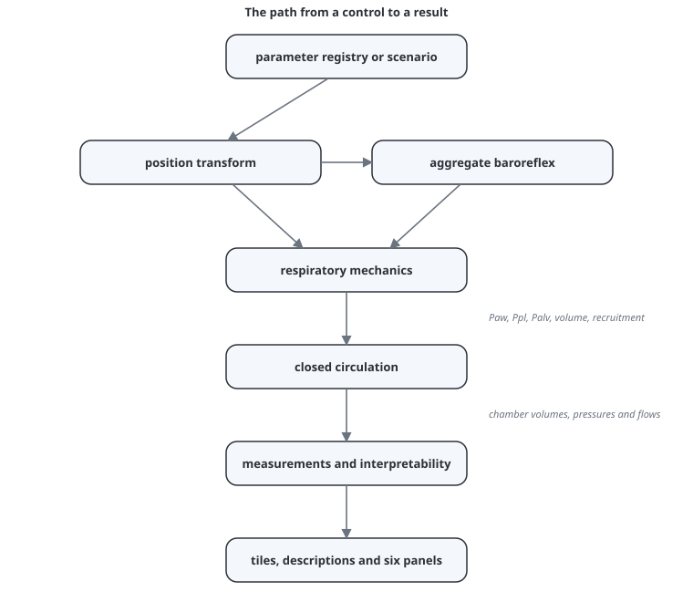

# Model architecture

> A dependency-free JavaScript model advances respiratory mechanics, autonomic control and a closed circulation at one fixed time step, then exposes a selective read-only surface to the interface.

---

## The path from a control to a result

The order is causal. Position resolves the effective mechanics. The reflex reads filtered systemic pressure and modifies effective parameters. The respiratory step generates the pressures and lung state seen by the circulation. The circulation step moves blood through the chambers. Measurements and panels read the resulting state; they do not write physiological outputs.

## Modules

| file | responsibility |
|---|---|
| `src/model/parameters.js` | every user-facing parameter, range, default and help text |
| `src/model/scenarios.js` | partial parameter overrides defining teaching phenotypes |
| `src/model/position.js` | supine/prone parameter transformation |
| `src/model/baroreflex.js` | one bounded, slow aggregate compensator |
| `src/model/respiratory.js` | equation of motion, breath generator, EFL and holds |
| `src/model/lung.js` | nonlinear P–V relation, recruitment state and PVR components |
| `src/model/circulation.js` | chamber elastance, valves, vascular compartments, venous return and pulmonary transit |
| `src/model/simulator.js` | integration, settlement, traces, measurements and validity rules |
| `src/model/index.js` | selective public API used by UI modules |
| `src/ui/` | controls, tiles, descriptions and drawings |

The public API is a deliberate boundary. Browser UI modules import model functions only from `src/model/index.js`; internal files can be reorganised without allowing a panel to become a second source of physiological truth.

## State and integration

The circulation contains eight pressure-bearing compliant compartments—systemic artery and vein, both atria and ventricles, pulmonary artery and pulmonary vein—plus one pressureless pulmonary transport volume represented by eight mixing stages. Blood moves through one closed loop and total represented blood volume is conserved unless the user changes baseline stressed volume.

The ordinary differential equations use forward Euler integration with a fixed 0.25 ms step. The small step is required by low valve resistances. Protective flow limiting prevents a compartment from being drained below its numerical volume floor; reaching that protection marks the result invalid rather than silently treating the clipped state as physiology.

Reset creates respiratory, reflex and circulatory state and advances the model silently for 15 simulated seconds. This gives a usable initial display, although the slowest processes may continue adapting after the first frame.

## Sampling and display

The integrator runs independently of visual frame rate. Traces are sampled at <!-- CONSISTENCY: trace-sample-rate -->250 Hz<!-- /CONSISTENCY --> into <!-- CONSISTENCY: trace-window-seconds -->12<!-- /CONSISTENCY -->-second ring buffers. Haemodynamic means use exponential or cardiac-cycle windows chosen for their intended display. Panels read these shared measurements or exported analytic functions; model-backed manual figures import the same functions.

The manual viewer builds a compact full-text index from the authored Markdown, so search covers page content as well as titles and summaries. Documentation lint also compares explicitly marked repeated facts across pages and, where available, against exported model constants. This is a deterministic guard for selected values, not general semantic contradiction detection; unmarked prose still requires review.

The application has no runtime framework and no build step. Native ES modules run in the browser; Node is used only for tests, documentation tooling and figure generation. A static HTTP server is required because browsers do not load the module graph correctly from `file://`.

## Why this architecture

Vanilla JavaScript keeps the physiological model inspectable and portable. A framework would improve neither the differential equations nor their validation, while adding a second lifecycle around a small, continuously animated application. The explicit module boundary and registry provide the organisational benefit that a framework might otherwise supply.

Forward Euler is less sophisticated than adaptive higher-order integration, but it is deterministic, dependency-free and easy to audit. Its acceptability is constrained by time-step-refinement and positivity tests rather than assumed.

## Development provenance

The entire artefact—the physiological model, JavaScript application, tests, interface and manual—was generated by LLMs under human-in-the-loop direction, control and revision. GPT-5.6-Sol with the high reasoning setting was the principal model used to construct the physiology and write the manual. Other LLMs were used as cross-reviewers for three recurring questions: whether the project was internally coherent, whether its physiological statements were defensible against the available literature, and whether the manual truthfully described the code that actually ran.

The human role was substantive rather than ceremonial. A human clinician defined the teaching scope, supplied and selected literature, identified implausible behaviour, challenged proposed mechanisms, performed use testing and approved changes before merge. Substantive work is retained in Git history and reviewed through pull requests so that model and documentation decisions can be reconstructed.

Literature supplied during development, together with additional sources used for the manual, is cited on the relevant concept pages and consolidated in the [bibliography](bibliography.md). A citation documents the scientific input to a statement or modelling choice; it does not imply that an LLM-derived implementation reproduces the cited experiment quantitatively.

LLM cross-review and human review are development controls, not substitutes for independent validation. Their epistemic limits are discussed on [Validation](validation.md#development-review-and-validation).

## Limits

- One fixed time step can be inefficient and may conceal stiffness outside tested ranges.
- The 15-second reset settlement is not proof of equilibrium for every extreme parameter combination.
- Lumped compartments cannot produce spatial gradients, wave propagation or regional heterogeneity.
- A selective public API prevents accidental coupling but does not prove the exported physiology is correct.
- Model-generated figures remain faithful to code even if the code embodies an invalid assumption.
- LLM authors and reviewers can share assumptions or failure modes; agreement among them does not establish physiological truth.
- Browser performance and numerical precision can differ slightly across engines, although deterministic tests constrain supported environments.

## Validation

The suite checks volume conservation, positivity, deterministic replay, time-step refinement and the public API boundary. It also verifies that the analytic curves drawn by panels agree with the equations used by the integrator. See [Validation](validation.md).

## References

- Hairer E, Nørsett SP, Wanner G. *Solving Ordinary Differential Equations I: Nonstiff Problems*. 2nd ed. Springer; 1993. [doi:10.1007/978-3-540-78862-1](https://doi.org/10.1007/978-3-540-78862-1)
- Sagawa K, Maughan L, Suga H, Sunagawa K. *Cardiac Contraction and the Pressure–Volume Relationship*. Oxford University Press; 1988.

---

## See also

[Validation](validation.md) · [Global limits](global-limits.md) · [Conventions](conventions.md) · [Numerical tiles](numeric-tiles.md) · [`MODEL_DECISIONS.md`](../docs/MODEL_DECISIONS.md)
