# The Guyton diagram

> The default view updates venous return and a local RV-function curve continuously, with low computational cost. An optional Deep CO experiment measures whole-heart output at the LV outlet. Both use atmospheric right atrial pressure on the horizontal axis.

---

## Physiology

Blood must be able to return to the heart and pass through the right ventricle, lungs and left ventricle. At whole-circuit steady state, mean venous return, RV output and LV output are equal. The descending venous-return relation and ascending cardiac-output relation therefore share a steady operating point.

The default ascending relation is labelled **RV function**. It estimates RV output from right atrial filling, RV diastolic mechanics, contractility and pulmonary arterial load. It is a local analytic approximation, not an independently calculated LV-response curve. The formula is updated from the displayed circulation on every redraw; it does not wait for a new loading experiment to settle.

In the optional deep mode, the ascending relation is labelled **Cardiac output (LV)**. This means aortic output from a heart containing both ventricles. It does not mean that right atrial pressure is being substituted for left atrial pressure in a single-LV filling equation. A weak LV can raise pulmonary and right-heart filling pressures and limit whole-heart flow; a pressure-loaded RV can likewise limit the blood reaching the LV.

Reduced venous inflow can relieve excessive distension. That may be useful even without a rise in flow, but does not itself prove that a cardiac-function curve has improved. A better response means more flow at comparable filling pressure, or lower filling pressure for comparable flow, under specified loading conditions. Right atrial pressure here is relative to atmosphere: it can rise when external cardiac pressure rises even while transmural filling pressure falls.

## The default dynamic view

- **RV function** is the rapidly updated ascending relation. Its highlighted steep segment corresponds to the local RV preload-reserve construction.
- **Venous return** is the descending relation determined by systemic filling pressure, caval closing pressure and resistance to return.
- **mean venous inflow**, the dark marker, uses net IVC-to-right-atrial venous inflow over a complete breath: forward volume minus backward volume, divided by elapsed time. It is not RV output, LV output or cardiac output.
- **predicted equilibrium**, the hollow marker shown in Mean, is the crossing of the local RV and venous-return relations on the same respiratory-mean clock.
- **inflow path**, the faint trail, retains one-heartbeat means of venous inflow and right atrial pressure. It displays temporary storage and respiratory timing.

**Live** is the default. Both curves follow respiratory excursions using determinants smoothed over one heartbeat. This removes cardiac pressure ripple while preserving breathing movement. **Mean** switches both curves to determinants averaged over a full breath, making their average position easier to compare across settings. Click again to return to Live. The selection changes only the display; it does not change the simulated patient or launch a loading experiment.

The RV construction uses right atrial pressure, RV end-diastolic/end-systolic volumes, heart rate and RV contractility on the selected clock. The chamber endpoints are latched at completed beats; this is a rapidly updated local approximation, not a direct instantaneous output measurement. The mean mode constructs a curve from mean determinants, rather than averaging the drawn curves point by point.

The mean venous-inflow marker retains its respiratory clock in both views; the faint trail retains the within-breath inflow path. Live withholds the predicted-equilibrium marker: even curves on the same heartbeat clock do not establish instantaneous whole-circuit equilibrium while blood is being stored or released between compartments.

At steady state mean venous inflow and the predicted crossing should be close. During redistribution, venous return and LV output can differ because blood is being stored or released between them. In pulmonary embolism or severe RV pressure loading, the trail can be broad while the respiratory-mean points remain close once the whole circulation settles. Drawing a trail from successive predicted crossings would hide that dynamic information.

The descending curve retains the forward-return formula, whereas measured inflow includes brief caval reversal. Nonlinear collapse also means that flow calculated from mean pressures need not equal the mean of instantaneous flows. Consequently, even in a settled pulsatile circulation, the curve at measured mean RAP need not pass through the dark marker. This gap is distinct from the distance between the dark marker and the hollow crossing. Neither marker is moved to force agreement. See [venous return](venous-return.md) for the flow definition and [vascular waterfalls](vascular-waterfalls.md) for the conservative reverse-flow law and its limits.

No deep-response worker, loading simulation or background precomputation starts in this default view. The ventricular pressure-volume panels continue their ordinary live display.

## Healthy passive volume control: PEEP 5 to 15

Select **Healthy, passive volume control**, then change only PEEP from 5 to 15 cmH2O. Tidal volume remains 450 mL, respiratory rate 14/min, heart rate 75/min and autonomic feedback off. Distinguish the immediate respiratory/transient movement from the position reached after redistribution. Mean makes the latter easier to compare; Live shows the excursion around each state.

The same tidal volume can occur around a higher end-expiratory lung volume. In this preset, greater lung inflation increases pleural and abdominal pressures through the represented lung-wall and diaphragm-abdomen mechanics. The RV curve moves right on an axis referenced to atmosphere: a higher surrounding cardiac pressure requires a higher internal pressure for the same distension. The measured atrial pressure can therefore rise while its transmural component falls. The local curve also incorporates changes in RV filling and ejection load; its translation is not an isolated measure of contractility.

The venous-return curve shifts because its determinants change. Abdominal pressure contributes to the upstream reservoir pressure, and redistribution increases the blood stored in that reservoir even though no fluid is added. Both raise Pmsf. The abdominal closing pressure also rises and moves the curve's knee. The linear resistance to venous return remains unchanged in this particular comparison. An increase in atrial pressure alone would instead move the operating point along an unchanged return curve.

The opposing changes are unequal: higher Pmsf only partly preserves the effective return gradient, and settled output falls. The pulmonary resistance coefficient also rises modestly; the protocol does not isolate its contribution to the output change. The pericardial excess-pressure term remains zero in this preset. No autonomic venoconstriction is being invoked with the reflex off.

`node tools/experiments/healthy-peep.mjs output.json` reproduces the sequential intervention in one closed circulation: 135 s initial settlement, two 60 s measurement windows, only PEEP changed, then 120 s settlement and two further 60 s windows. Each measurement window contains 75 heartbeats and 14 breaths. The report contains directly integrated aortic/pulmonic/venous flows, pressure and volume means, the elastic and abdominal Pmsf components, respiratory curve excursions, parameter-difference checks, volume balance and cardiac-domain checks. Values are model outputs, not patient-specific predictions.

## Optional Deep CO analysis

Select **Deep CO** to request one computationally intensive whole-heart loading experiment for the displayed settings. **Calculating cardiac output curve** means the optional curve is not ready. The patient keeps running while separate copies are analysed. This uses eight inflow levels, not eight cardiac cycles; each level may require several minutes of simulated circulation.

The button becomes **Live RV**: selecting it cancels the experiment immediately and restores the fast view. Changing a parameter, selecting a scenario or resetting also cancels the experiment and returns to the fast view. Deep computation requires a fresh opt-in. The choice is not saved in patient files or carried across reloads. To refresh an autonomically compensated reference, return to Live RV and select Deep CO again.

- **Cardiac output (LV)** is the red response curve from separate loading experiments. Only settled, physiologically admissible segments are drawn. An ending line means the tested range has ended; it is not an extrapolated plateau or a prediction of arrest.
- **mean LV output**, the additional red marker, is integrated aortic flow averaged over the most recent complete respiratory cycle after heartbeat smoothing. Its horizontal coordinate is the matching mean right atrial pressure. The marker and its numerical description are withheld when the displayed patient is outside the model domain.
- The dark mean venous-inflow marker and faint inflow path retain their measured meaning. The hollow crossing uses the separately settled reference relations.

In deep mode, **VR mean** uses the settled reference pressure and resistance determinants paired with the cardiac-response experiment. **VR live** uses all three current determinants together and withholds the predicted crossing. Live markers and the trail continue to describe the displayed patient. The deep relation is a settled loading analysis, not a breath-by-breath replacement for the dynamic view.

## How the cardiac-output curve is measured

The analysis first settles a separate reference with the selected respiratory mechanics and effective cardiac/vascular parameters. Autonomic feedback is held fixed: heart rate, contractility, arterial resistance and reflex venous recruitment retain their sampled values. Body-position effects are applied once to the selected respiratory prescription.

Each disposable copy receives a different controlled inflow into the right atrium. The normalized pulsatile inflow shape is the same as in the reference. The respiratory trajectory and the systemic source-pressure trajectory are also shared. Arterial resistance and compliance remain active, so arterial pressure responds to the flow generated by each copy; fixed vascular properties do not mean fixed aortic pressure.

Both atria, both ventricles, the pressure-driven valves, pulmonary resistance and storage, pulmonary transit, septal coupling and pericardial constraint continue to use the patient's model equations. The analysis measures the mean right atrial pressure required to sustain the imposed inflow and independently integrates aortic and pulmonic output. This is an inverse way of constructing a cardiac-function curve: the input is controlled, and the required filling pressure is an outcome.

The experiment opens the systemic return pathway only in the copies. The external source supplies the prescribed inflow; its net contribution must equal the change in central stored volume plus aortic outflow. The running patient's closed circulation is not altered.

The first minute permits redistribution. Subsequent complete minute windows check agreement of imposed inflow, RV output and LV output and stability between windows. A point is accepted only within a 0.5% flow tolerance, with finite values, conserved central volume and valid cardiac phases/pressure relations. Mean right atrial pressure must also change by less than 0.05 mmHg plus 0.5% of its magnitude between windows. Slow cases may use up to five minutes of simulated loading. Unsettled or invalid points are omitted, and lines do not bridge missing intervals.

The plotted line interpolates a finite set of loading experiments. It is conditioned on the selected reference respiratory and vascular state, including its inflow waveform. Agreement at the reference point is an internal consistency check, not independent clinical validation or an unrestricted prediction of a different circulation.

## Scope of related readouts

The **RV preload reserve** tile uses the local analytic RV construction on the respiratory-mean clock. The highlighted segment follows the selected fast-curve clock, so a breathing-phase highlight need not match the tile's mean value. Neither independently tests LV reserve or gives the derivative of the optional whole-heart curve. The [preload-reserve page](preload-reserve.md) explains this boundary. No RV-only slope is highlighted on the deep whole-heart curve.

Occlusion marks retain their measured pressure/venous-inflow meaning. Their extrapolated intercept is not automatically the model's true Pmsf: a hold can change the pressure conditions being sampled. See [Pmsf and occlusions](pmsf-and-occlusions.md).

## Limits

- The curve describes the represented mechanical heart and circulation, not myocardial oxygen consumption, ischaemia, mitral regurgitation or pulmonary oedema clearance.
- A change in curve position combines the represented loading effects. It is not automatically a change in intrinsic contractility.
- The deep reference freezes autonomic drive; request a fresh experiment to inspect a different compensated state.
- An unavailable tail must not be read as a validated physiological maximum.
- Minute-window reference experiments and respiratory-window live markers are intentionally distinct; immediate post-intervention separation is not itself a model error.

## References

- Guyton AC, Lindsey AW, Kaufmann BN. Effect of mean circulatory filling pressure and other peripheral circulatory factors on cardiac output. *Am J Physiol*. 1955;180:463–468. [doi:10.1152/ajplegacy.1955.180.3.463](https://doi.org/10.1152/ajplegacy.1955.180.3.463)
- Guyton AC, Lindsey AW, Abernathy B, Richardson T. Venous return at various right atrial pressures and the normal venous return curve. *Am J Physiol*. 1957;189:609–615. [doi:10.1152/ajplegacy.1957.189.3.609](https://doi.org/10.1152/ajplegacy.1957.189.3.609)
- Henderson WR, Griesdale DEG, Walley KR, Sheel AW. Clinical review: Guyton — the role of mean circulatory filling pressure and right atrial pressure in controlling cardiac output. *Crit Care*. 2010;14:243. [doi:10.1186/cc9247](https://doi.org/10.1186/cc9247)
- Magder S. Bench-to-bedside review: an approach to hemodynamic monitoring—Guyton at the bedside. *Crit Care*. 2012;16:236. [doi:10.1186/cc11395](https://doi.org/10.1186/cc11395)
- Magder S. Heart–lung interaction in spontaneous breathing subjects: the basics. *Ann Transl Med*. 2018;6:348. [doi:10.21037/atm.2018.06.19](https://doi.org/10.21037/atm.2018.06.19)

---

## See also

[Venous return](venous-return.md) · [Inferior vena cava](inferior-vena-cava.md) · [Vascular waterfalls](vascular-waterfalls.md) · [Preload reserve](preload-reserve.md) · [Pmsf and occlusions](pmsf-and-occlusions.md) · [Manoeuvres](manoeuvres.md)
