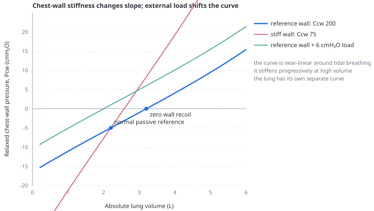

# Pleural pressure

> The pressure surrounding the heart, intrathoracic vessels and lung. In the model it comes from an independent chest-wall relaxation curve, shifted by any external wall load and by respiratory-muscle pressure.

---

## Physiology

At passive end-expiration, lung recoil pulls inward while the chest wall usually tends outward. Functional residual capacity is the volume at which those opposing forces balance, so alveolar pressure equals atmospheric pressure even though pleural pressure is subatmospheric.

During inspiration, the sign depends on who expands the thorax:

- A **ventilator** raises alveolar pressure and displaces the wall outward. Pleural pressure rises.
- The **inspiratory muscles** pull the wall outward. Pleural pressure falls.

This sign reversal explains much of heart–lung interaction. Positive-pressure inspiration raises measured right atrial pressure while opposing venous return; spontaneous inspiration can lower measured CVP while increasing the transmural filling pressure and the gradient for venous return.

### Swing, resting pressure and load are not the same thing

Chest-wall compliance mainly determines how much pleural pressure changes for a given tidal displacement. Near the usual operating range:

$$
\Delta P_{pl}\approx\frac{V_T}{C_{cw}}
$$

A wall load does something different. Obesity, ascites or a raised diaphragm can shift the entire relaxed pressure–volume relation, making pleural pressure less negative or positive at rest even if its local slope is unchanged. A patient may have low compliance, a positive load, or both.

A stiff lung is different again. It raises airway pressure because more transpulmonary pressure is required to deliver volume. At the same volume and with the same wall, it does not automatically create the same rise in pleural pressure. High plateau pressure is therefore not a reliable surrogate for the pressure surrounding the heart.

---

## In the model

The relaxed wall is a sigmoid function of absolute volume:

$$
P_{cw}=F_{cw}(V;C_{cw})+L_{cw}
$$

Pleural pressure then includes respiratory effort:

$$
P_{pl}=P_{cw}-P_{mus}
$$

$P_{mus}$ is an effective pressure-generating state, not an on/off copy of neural inspiration. It rises during the inspiratory command and decays through early expiration. While this post-inspiratory activity persists, pleural pressure remains more negative than the relaxed chest-wall pressure and expiratory flow is braked. The [Campbell diagram](panel-campbell.md#what-happens-during-active-expiration) shows why the active expiratory trajectory therefore approaches $C_{cw}$ gradually instead of falling onto it as soon as inspiration ends.

The pressure that distends the lung is then:

$$
P_L=P_{alv}-P_{pl}
$$

- $P_L$ — transpulmonary pressure, in cmH₂O;
- $P_{alv}$ — alveolar pressure, in cmH₂O;
- $P_{pl}$ — pleural pressure, in cmH₂O.

The interface therefore gives these pressures different visual roles. The pleural-pressure tile and waveform rail put the current Ppl in the foreground and retain the latest breath's swing as secondary context. A Palv tile and curve expose the pressure inside the alveolar compartment and its gradient from Paw. A separate $P_L$ tile and trace show the pressure across the lung. This keeps “pressure at the airway”, “pressure inside the alveoli”, “pressure around the circulation” and “pressure distending the lung” distinct.

Because the model uses Palv and Ppl directly, its dynamic $P_L$ trace is not the same construction as the clinical surrogate $P_{aw}-P_{es}$ while gas is flowing. Paw still contains the pressure lost across airway resistance, and Pes is a regional estimate rather than the global Ppl known by the model. The two approach one another during a valid zero-flow pause. See [the waveform panel](panel-waveforms.md#why-the-model-trace-can-differ-from-bedside-dynamic-pl).

The default curve is calibrated so that at the normal 2.2 L reference, $P_{cw}=-5$ cmH₂O and the local slope corresponds to 200 mL/cmH₂O. Its relaxed zero-recoil volume is higher, near 3.2 L: below that volume the wall tends outward; above it the wall tends inward. These are model reference values, not universal patient normals.

`Chest wall compliance` changes the local slope. `Chest wall load` adds a pressure offset without changing that selected slope. The two controls are kept separate because they have different consequences:

| change | main immediate effect |
|---|---|
| lower `ccw` | larger pleural-pressure swing for the same tidal volume |
| higher `cwLoad` | higher relaxed wall pressure at every absolute volume; lower passive equilibrium volume |
| lower `clung` | more transpulmonary and airway pressure needed for a given volume |

The wall curve is nearly linear around ordinary tidal breathing but bends at larger volume excursions. Consequently, the simple $V_T/C_{cw}$ relation remains a useful local approximation, not an identity imposed at all volumes.

### Pleural pressure during pressure support

PSV does not imply that absolute Ppl must be positive. The ventilator-driven increase in volume raises relaxed chest-wall pressure, while inspiratory muscle pressure lowers Ppl:

$$
P_{pl}=P_{cw}(V)-P_{mus}
$$

The net sign depends on resting chest-wall load, PEEP, delivered volume and effort. A patient with obesity, abdominal loading or a high resting oesophageal pressure may remain positive throughout the breath; the default unloaded wall can remain negative despite positive airway pressure. A completely passive patient cannot trigger conventional PSV, so “relaxed PSV” still requires a small effective effort.

The timing follows the same balance. Ppl falls when muscle pressure is increasing faster than chest-wall recoil pressure. After the patient generates the pneumatic trigger, ventilator inflation can transiently flatten or partly reverse that fall by expanding the wall. If the ventilator cycles before neural inspiration ends, Ppl can continue to fall after Paw has returned to PEEP. That pattern is early cycling, not post-inspiratory braking; braking begins only after neural switch-off while effective muscle pressure decays.

### The passive reference now emerges

The model no longer assigns −5 cmH₂O pleural pressure to whichever volume the selected lung reaches at 5 cmH₂O transpulmonary pressure. Instead, it solves the intersection of independent lung and wall recoil:

$$
P_l(V_{relax})+P_{cw}(V_{relax})=0
$$

A collapsed, stiff lung therefore finds equilibrium at a lower volume, where the unchanged wall pulls outward more strongly and transpulmonary pressure is higher. Loss of lung recoil moves equilibrium upward. This is the physiologically important consequence of making the wall independent.

### Body position and the abdomen

Prone position reduces the selected chest-wall compliance to 65% of its supine value, raises abdominal pressure by 2 cmH₂O and lowers the opening-pressure distribution of recruitable lung. These are coarse, simultaneous transformations. Recruitment may offset the expected change in mean pleural pressure, so the model validates chest-wall stiffening from the **larger within-breath pleural swing**, not by requiring mean pleural pressure to rise in every phenotype.

The obesity and intra-abdominal-hypertension scenarios also use a positive wall load. This pressure is selected independently from abdominal pressure because the model has no geometry from which to calculate transmission. It must not be read as a measured abdominal-to-pleural transmission fraction.

---

## Why this implementation

An independent wall curve fixes a structural problem that a linear wall could not fix by retuning. Previously, lung disease moved the wall's reference relation along with the lung, so the model could not express the higher transpulmonary pressure expected when a stiff, low-volume lung is held open by an otherwise unchanged thorax.

The model still uses one aggregate wall. Dividing it into rib cage, diaphragm and abdominal wall would allow more accurate posture and obesity mechanics, but would introduce several poorly constrained compartments outside the app's main purpose: mechanical interaction between ventilation and circulation.

A fixed airway-to-pleural transmission fraction was rejected. Pressure transmission is an outcome of lung recoil, wall recoil, volume and load. It should change when those properties change.

---

## Limits

- One pleural pressure replaces vertical and regional gradients.
- The displayed Ppl and $P_L$ are exact internal states, not measured oesophageal or regional transpulmonary pressures.
- There is no separate rib cage, diaphragm, abdominal wall or zone-of-apposition geometry.
- `cwLoad` is an aggregate offset, not a body-mass or intra-abdominal-pressure model.
- The remote curvature of the sigmoid is a didactic shape choice; it has not been fitted to an individual human relaxation manoeuvre.
- Oesophageal pressure measurement, calibration, positional artefact and occlusion testing are absent.
- Muscle pressure is one aggregate activation with post-inspiratory decay. Separate expiratory-muscle recruitment, variable neural drive, fatigue and a full dyssynchrony model are absent.
- PSV uses one fixed flow trigger, pressure rise and cycling percentage; displayed Ppl is not a simulated oesophageal-balloon signal.
- Prone coefficients are representative directional choices, not predictions for an individual patient.

---

## References

- Rahn H, Otis AB, Chadwick LE, Fenn WO. The pressure-volume diagram of the thorax and lung. *Am J Physiol*. 1946;146:161–178. [doi:10.1152/ajplegacy.1946.146.2.161](https://doi.org/10.1152/ajplegacy.1946.146.2.161)
- Agostoni E, Hyatt RE. Static behavior of the respiratory system. In: *Handbook of Physiology, The Respiratory System*. 1986:113–130. [doi:10.1002/cphy.cp030309](https://doi.org/10.1002/cphy.cp030309)
- Pereira C, Bohé J, Rosselli S, et al. Sigmoidal equation for lung and chest wall volume-pressure curves in acute respiratory failure. *J Appl Physiol*. 2003;95:2064–2071. [doi:10.1152/japplphysiol.00385.2003](https://doi.org/10.1152/japplphysiol.00385.2003)
- Behazin N, Jones SB, Cohen RI, Loring SH. Respiratory restriction and elevated pleural and esophageal pressures in morbid obesity. *J Appl Physiol*. 2010;108:212–218. [doi:10.1152/japplphysiol.91356.2008](https://doi.org/10.1152/japplphysiol.91356.2008)
- Akoumianaki E, Maggiore SM, Valenza F, et al. The application of esophageal pressure measurement in patients with respiratory failure. *Am J Respir Crit Care Med*. 2014;189:520–531. [doi:10.1164/rccm.201312-2193CI](https://doi.org/10.1164/rccm.201312-2193CI)
- Cecconi M, Collino F, Pinsky MR. Heart–lung interactions in ARDS. *Intensive Care Med*. 2026. [doi:10.1007/s00134-026-08583-3](https://doi.org/10.1007/s00134-026-08583-3)
- Shee CD, Ploy-Song-Sang Y, Milic-Emili J. Decay of inspiratory muscle pressure during expiration in conscious humans. *J Appl Physiol*. 1985;58:1859–1865. [doi:10.1152/jappl.1985.58.6.1859](https://doi.org/10.1152/jappl.1985.58.6.1859)
- Jonkman AH, Telias I, Spinelli E, et al. The oesophageal balloon for respiratory monitoring in ventilated patients: updated clinical review and practical aspects. *Eur Respir Rev*. 2023;32:220186. [doi:10.1183/16000617.0186-2022](https://doi.org/10.1183/16000617.0186-2022)
- Mojoli F, Pozzi M, Orlando A, et al. Timing of inspiratory muscle activity detected from airway pressure and flow during pressure support ventilation: the waveform method. *Crit Care*. 2022;26:32. [doi:10.1186/s13054-022-03895-4](https://doi.org/10.1186/s13054-022-03895-4)

---

## See also

[Transmural pressure](transmural-pressure.md) · [Equation of motion](equation-of-motion.md) · [Pressure–volume curve](pressure-volume-curve.md) · [Abdominal pressure](abdominal-pressure.md) · [The Campbell diagram](panel-campbell.md) · [Clinical scenarios](scenarios.md)
