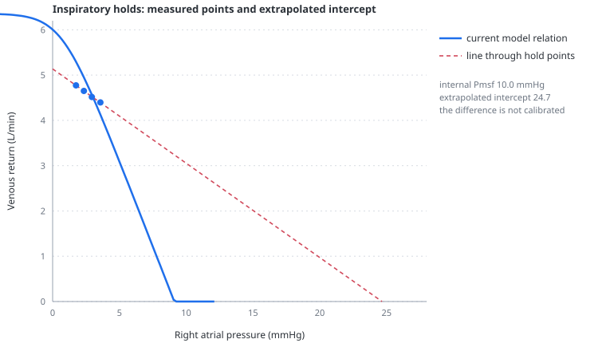

# Pmsf and occlusions

> Inspiratory holds can generate a venous pressure-flow relation and an extrapolated zero-flow intercept, but that intercept is not a direct measurement of mean systemic filling pressure and can be biased by the manoeuvre itself.

---

## Physiology

Mean systemic filling pressure, $P_{msf}$, is the equilibrated pressure of the systemic vascular compartment when flow is zero. In an intact circulation it cannot be observed directly without stopping flow, so bedside methods estimate it.

An inspiratory hold raises intrathoracic and right atrial pressure while cardiac output falls. Repeating the hold at several plateau pressures produces several pairs of right atrial pressure and flow. If those points lie approximately on a straight line, extrapolating that line to zero flow gives an intercept:

$$
\dot{Q}_{vr} = a + bP_{ra}
$$

- $\dot{Q}_{vr}$ — measured venous return or its cardiac-output surrogate, L/min
- $P_{ra}$ — right atrial pressure during the hold, mmHg
- $a$ — fitted flow-axis intercept, L/min
- $b$ — fitted slope, L/min/mmHg; negative for a falling venous-return relation

The extrapolated pressure-axis intercept is:

$$
P_{intercept} = -\frac{a}{b}
$$

- $P_{intercept}$ — pressure at which the fitted line predicts zero flow, mmHg

Calling that value Pmsf assumes every hold samples the same venous-return relation and changes only right atrial back-pressure. The assumption can fail: lung inflation and abdominal transmission can change the upstream pressure, caval waterfall and resistance while the points are being acquired.

---

## In the model

The inspiratory hold starts at end inspiration, stops gas flow and sets airway pressure equal to alveolar pressure. The circulation continues to run for the selected duration. Only the final 40% of the hold is averaged, allowing the initial transient to settle before one right-atrial-pressure/flow pair is stored.

<!-- BEGIN GENERATED: pmsf-occlusions -->
*Executable setup: inspiratory holds lasting 10 s follow delivered tidal volumes of 300, 500, 700, 900 mL. Only the final 40% of each hold is averaged.*

| delivered VT (mL) | hold airway pressure (cmH₂O) | mean right atrial pressure (mmHg) | venous return (L/min) |
|---:|---:|---:|---:|
| 300 | 8.06 | 1.56 | 5.15 |
| 500 | 10.14 | 2.19 | 5.00 |
| 700 | 12.24 | 2.84 | 4.85 |
| 900 | 14.37 | 3.53 | 4.71 |

The fitted pressure–flow line has a slope of -0.22 L/min/mmHg and reaches zero flow at 24.5 mmHg. The model's internal Pmsf after the protocol is 10.3 mmHg.
<!-- END GENERATED: pmsf-occlusions -->

The discrepancy is not a plotting error. Each larger inflation pressurises the abdomen and changes the systemic reservoir while it is being sampled, so the four points belong to a family of shifted relations. The line through them is real; interpreting its intercept as the one fixed upstream pressure is not.

The panel therefore labels the result `intercept … extrapolated`, not `Pmsf measured`. The model's internal Pmsf remains separately labelled on the analytic venous-return curve.

---

## Why this and not something else

It would be easy to force the fitted intercept to equal the model's known Pmsf. Doing so would hide the central experimental limitation and turn the simulator into a scripted demonstration of the expected answer. The manoeuvre is allowed to perturb the same abdomen, pleural pressure and vascular waterfall used during ordinary breathing; the bias emerges from those mechanisms.

The result is not tuned to the published magnitude. Berger and colleagues found that inspiratory-hold extrapolation exceeded balloon-occlusion MSFP by a mean 3.0 mmHg in anaesthetised pigs. The model's gap is much larger and is therefore taught as an uncalibrated qualitative warning, not as a human prediction.

---

## Limits

### Of the construction

- Flow is represented by model venous return rather than a particular clinical cardiac-output monitor and its response time.
- The venous system is one reservoir, so regional time constants and separate SVC/IVC responses are absent.
- The same abdominal coupling that creates the bias is an aggregate coefficient, not a calibrated human splanchnic model.
- Holds are perfectly timed and noise-free; fitting uncertainty and measurement artefact are absent.
- The model knows its internal Pmsf exactly, a privilege unavailable in an intact patient.

### Of clinical application

- The model cannot establish the accuracy or interchangeability of bedside Pmsf methods.
- Its approximately 15 mmHg overestimate must not be expected in a patient or used to correct a measured value.
- A linear set of hold points does not prove that their zero-flow intercept equals the pressure that would be measured after true circulatory arrest.
- The manoeuvre is an explanatory tool, not a recommendation to perform prolonged holds in a particular patient.

---

## Validation

Executable checks require a hold to stop gas flow, make airway and alveolar pressure equal, raise right atrial pressure, lower flow and yield one stable measured point. Four rising-pressure holds must generate four points with increasing right atrial pressure and decreasing flow. The documented magnitude is regenerated from the current model rather than used as a numerical acceptance target.

---

## References

- Maas JJ, Geerts BF, van den Berg PCM, Pinsky MR, Jansen JRC. Assessment of venous return curve and mean systemic filling pressure in postoperative cardiac surgery patients. *Crit Care Med*. 2009;37:912–918. [doi:10.1097/CCM.0b013e3181961481](https://doi.org/10.1097/CCM.0b013e3181961481)
- Berger D, Moller PW, Weber A, et al. Effect of PEEP, blood volume, and inspiratory hold maneuvers on venous return. *Am J Physiol Heart Circ Physiol*. 2016;311:H794–H806. [doi:10.1152/ajpheart.00931.2015](https://doi.org/10.1152/ajpheart.00931.2015)
- van Loon LM, van der Hoeven JG, Veltink PH, Lemson J. The inspiration hold maneuver is a reliable method to assess mean systemic filling pressure but its clinical value remains unclear. *Ann Transl Med*. 2020;8:1390. [doi:10.21037/atm-20-3540](https://doi.org/10.21037/atm-20-3540)
- Persichini R, Lai C, Teboul JL, et al. Venous return and mean systemic filling pressure: physiology and clinical applications. *Crit Care*. 2022;26:150. [doi:10.1186/s13054-022-04024-x](https://doi.org/10.1186/s13054-022-04024-x)

---

## See also

[Venous return](venous-return.md) · [Stressed volume](stressed-volume.md) · [Abdominal pressure](abdominal-pressure.md) · [The Guyton panel](panel-guyton.md) · [Manoeuvres](manoeuvres.md)
