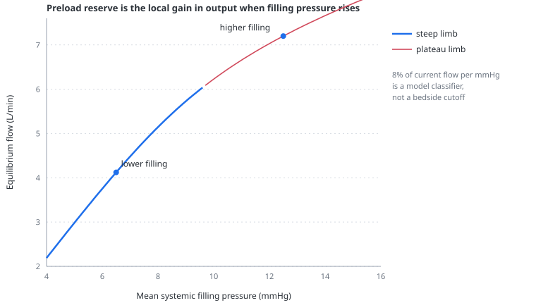

# Preload reserve

> Preload reserve asks how much additional output the current circulation gains when its filling pressure rises; the model reads that local gain from the intersection of venous return and cardiac function rather than inferring it from PPV.

---

## Physiology

Fluid responsiveness means that a reversible or actual increase in cardiac preload produces a clinically meaningful increase in stroke volume or cardiac output. It is not the same as hypovolaemia, and it does not establish that fluid is indicated: a responder may already be adequately perfused, while fluid can cause harm even when output rises.

The [Guyton construction](venous-return.md) makes the mechanism visible. Raising mean systemic filling pressure moves the venous-return relation and shifts the operating point. If the cardiac function curve is steep there, flow rises. If it is flat, the new intersection moves mainly toward higher filling pressure.

The clinically familiar fluid challenge is a finite volume intervention. The model's reserve is instead a local slope: it asks what an additional millimetre of filling pressure would buy at the current point. That keeps the question independent of how much of a real bolus remains intravascular or reaches a particular capacitance bed.

---

## In the model

The simulator raises and lowers model Pmsf by 0.5 mmHg around the current state, recomputes the intersection of the same venous-return and cardiac-function curves drawn in the panel, and estimates the central slope:

$$
R_{preload} = \frac{1}{Q}\frac{\Delta Q}{\Delta P_{msf}}
$$

- $R_{preload}$ — local preload reserve, fraction of current output per mmHg
- $Q$ — equilibrium flow at the current model state, L/min
- $\Delta Q$ — change in equilibrium flow across the small Pmsf perturbation, L/min
- $\Delta P_{msf}$ — change in mean systemic filling pressure, mmHg

The value is displayed as percent of current output per mmHg. A value of 0.10 therefore reads “about 10% more output for one additional mmHg of filling pressure” within the local construction.

The panel highlights the limb at or above 8%/mmHg. This split is a model classifier, not a clinical threshold. After correction of ventricular activation, a deterministic sweep across loading, resistance, heart rate, RV function, venous compliance, PEEP and abdominal pressure found that this boundary agreed with the model's own definition of a 500 mL responder in about 87% of configurations. Discordance is expected because a finite bolus can cross the knee of the curve and because venous compliance determines how much pressure a given volume buys.

### A reproducible comparison

With passive volume control, VT 560 mL, RR 14/min, PEEP 5 and baroreflex disabled:

| model state | local reserve | output before | output after +500 mL selected stressed volume | gain |
|---|---:|---:|---:|---:|
| lower filling — 300 mL selected stressed volume | 15.9%/mmHg | 3.79 L/min | 5.65 L/min | +49% |
| higher filling — 900 mL selected stressed volume | 6.8%/mmHg | 5.91 L/min | 6.76 L/min | +14% |

The exact gains are properties of these model states. The point is the separation: the same added volume raises output much more on the steep limb.

Unlike PPV, preload reserve remains available during spontaneous breathing and low tidal volume because it is not read from a respiratory waveform. It can still become unavailable if the two analytical curves have no finite crossing.

---

## Why this and not something else

PPV was deliberately not used as the fluid-responsiveness verdict because its amplitude depends on ventilation, rhythm, RV afterload and transmission. A model can reproduce a large waveform swing for the wrong reason. Reading the local equilibrium slope asks the intended question directly inside the model: does more filling raise flow?

The calculation is expressed per mmHg rather than per millilitre. Converting pressure reserve to a predicted fluid volume would require assuming distribution, venous compliance and retention of the bolus — the same unknowns a bedside challenge is designed to test.

---

## Limits

### Of the construction

- The reserve is derived from a steady-state analytical construction applied to a breathing closed-loop simulation.
- The 8%/mmHg split is a didactic classifier with broad, not exact, agreement with the model's 500 mL experiment.
- The slope is local; a finite intervention can leave the steep limb and yield less benefit than the derivative suggests.
- The cardiac-function approximation uses the current model RV afterload and does not simulate a full new steady state at every infinitesimal point.
- Added volume is placed immediately in one venous reservoir with no distribution or loss.

### Of clinical application

- The readout is not a validated bedside index and cannot prescribe fluid.
- It does not distinguish a patient who is preload responsive from one who actually needs increased flow.
- It cannot reproduce PLR physiology, autotransfusion distribution or the pharmacokinetics of a fluid challenge.
- The percentage should be compared only within the model, not with clinical PPV or a published fluid-response cutoff.

---

## Validation

Executable tests require reserve to fall monotonically as selected stressed volume rises, classify low filling on the steep limb and high filling on the plateau, remain available when spontaneous breathing or low VT withholds PPV, and agree broadly with the model's own 500 mL response across the control space. The highlighted Guyton limb and numeric readout must classify the operating point identically.

---

## References

- Guyton AC, Lindsey AW, Kaufmann BN. Effect of mean circulatory filling pressure and other peripheral circulatory factors on cardiac output. *Am J Physiol*. 1955;180:463–468.
- Maas JJ, Geerts BF, van den Berg PCM, Pinsky MR, Jansen JRC. Assessment of venous return curve and mean systemic filling pressure in postoperative cardiac surgery patients. *Crit Care Med*. 2009;37:912–918. [doi:10.1097/CCM.0b013e3181961481](https://doi.org/10.1097/CCM.0b013e3181961481)
- Monnet X, Marik PE, Teboul JL. Prediction of fluid responsiveness: an update. *Ann Intensive Care*. 2016;6:111. [doi:10.1186/s13613-016-0216-7](https://doi.org/10.1186/s13613-016-0216-7)
- Messina A, Longhini F, Coppo C, et al. Use of the fluid challenge in critically ill adult patients: a systematic review. *Anesth Analg*. 2017;125:1532–1543. [doi:10.1213/ANE.0000000000002103](https://doi.org/10.1213/ANE.0000000000002103)

---

## See also

[Venous return](venous-return.md) · [Stressed volume](stressed-volume.md) · [Pulse pressure variation](pulse-pressure-variation.md) · [Pmsf and occlusions](pmsf-and-occlusions.md) · [The Guyton panel](panel-guyton.md)
