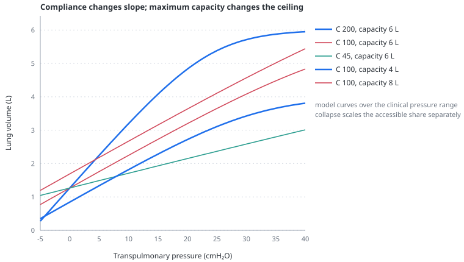

# The pressure–volume curve

> How much volume the model's fully open tissue holds at a given transpulmonary pressure. Its upper limb saturates; as a modelling choice, the expandable capacity scales with `clung`, so a lower compliance setting also produces a smaller fully open lung.

---

## Physiology

The relation between transpulmonary pressure and lung volume is sigmoid. At low pressure the curve is flat because units are shut and pressure is being spent opening them rather than inflating them. In the middle it is close to straight, and its slope there is what "compliance" ordinarily means. At high pressure it flattens again because the tissue reaches the limit of what it can be stretched to: collagen takes up the load, and further pressure buys almost no volume.

The upper flattening is the one that matters at the bedside. It is why plateau pressure rises disproportionately at the end of a large breath, why the [stress index](stress-index.md) can exceed 1, and why the injury of overdistension is a property of *strain* rather than of pressure.

### Aerated capacity is not a fixed number

A reference healthy lung reaches about 6 L near a transpulmonary pressure of 35 cmH₂O. In ARDS, the aerated baby lung has a smaller available volume even when its specific tissue mechanics are not uniformly abnormal. Whole-lung compliance therefore mixes available aerated size, recruitability and tissue behaviour.

The model links the upper-limb pressure scale to a compliance parameter so that a low-compliance phenotype reaches nonlinear distension within the simulated clinical range. This avoids a previous implementation in which a stiff phenotype retained a normal absolute capacity and remained almost linear until implausibly high pressures. It is a pragmatic representation, not a general physiological identity between low compliance and reduced total lung capacity.

---

## In the model

The tissue relation is linear below zero transpulmonary pressure and saturating above it, joined so that both value and slope are continuous at the join:

$$
V(P_l) = \begin{cases}
V_0 + C\,P_l & P_l \le 0\\[4pt]
V_0 + C\,S\left(1 - e^{-P_l/S}\right) & P_l > 0
\end{cases}
$$

- $V$ — volume held by one fully open lung's worth of tissue, L
- $P_l$ — transpulmonary pressure, cmH₂O
- $V_0$ — unstressed volume, L
- $C$ — the `clung` tissue-volume scale, L/cmH₂O; it equals the slope at zero transpulmonary pressure, not the measured respiratory-system compliance
- $S$ — a pressure scale, cmH₂O, over which the tissue saturates

Because the exponent is $P_l/S$ and $S$ is a **pressure**, the asymptotic tissue volume is $V_0 + C\,S$. The expandable component $C\,S$ is therefore proportional to `clung`; the fixed $V_0$ term means total capacity does not scale in exact proportion.

Below zero the curve is deliberately left linear. What empties a lung at negative distending pressure is units shutting, and the [open fraction](two-population-lung.md) already does that; making the tissue term collapse as well would count it twice.

### The two constants are solved, not chosen

$V_0$ and $S$ are not written down. They are solved at load by nested bisection from two anchors:

- 2.2 L at a transpulmonary pressure of 5 cmH₂O — resting recoil in a normal lung;
- 6.0 L at 35 cmH₂O — total lung capacity.

Both anchors are divided by the open fraction at their own pressure, so they describe *tissue* rather than a whole lung that is partly shut. Two textbook volumes therefore fix two constants, and the code enforces them rather than a person keeping them true by hand.

### What the model shows

| `clung` | volume at $P_l$ 5 | volume at $P_l$ 35 |
|---|---|---|
| 200 mL/cmH₂O | 2.25 L | 6.00 L |
| 100 | 1.78 | 3.65 |
| 45 | 1.52 | 2.36 |

For the reference normal parameters, the whole-lung curve reaches the 2.2 L and 6.0 L anchors; the table shows the corresponding fully open tissue volumes, which is why the first resting value is 2.25 L rather than 2.20 L. A `clung` setting of 45 mL/cmH₂O yields 2.36 L at 35 cmH₂O in this tissue relation. Calling that setting “ARDS” is a phenotype choice, not a universal ARDS capacity.

### The resting reference is calculated

There is no `frc` control. The model first calculates the lung volume held at 5 cmH₂O of transpulmonary recoil from open fraction and `clung`, then measures chest-wall displacement from that reference. End-expiratory volume at applied PEEP is subsequently solved from the combined respiratory relation:

| | end-expiratory volume at PEEP 5 |
|---|---|
| normal | 2.68 L |
| 30% collapsed | 1.93 L |
| 50% collapsed | 1.42 L |
| emphysematous, `clung` 400 | 3.77 L |

A lung with a higher `clung` setting has a higher calculated reference, while a lung with fewer open units has a lower one. Recruitment can therefore raise end-expiratory volume mechanically rather than being recorded as a separate label. This is not a fully independent lung–chest-wall equilibrium: the chest-wall curve is recentered on the lung-derived reference, as described under [pleural pressure](pleural-pressure.md).

---

## Why this and not something else

**A saturating exponential rather than a full sigmoid in pressure.** The classical fit is a logistic in pressure with four parameters. This model already has a separate mechanism for the lower limb — units opening — so a curve that also bent downward at the bottom would double-count it. The tissue term carries only the upper limb, and the open fraction carries the lower one. That separation is what lets recruitment and distension be told apart in the [stress index](stress-index.md).

**A pressure scale rather than an absolute capacity.** The first version wrote the ceiling as an absolute volume. A lung at 45 mL/cmH₂O then had to be driven to 195 cmH₂O before it stiffened, so the baby lung was the one place the model stayed perfectly linear — exactly where the question about overdistension is asked. The failure was not a wrong constant but a wrong *form*, and it is written up in [the postmortem](../docs/POSTMORTEM-2026-08-09.md).

**Solving the constants rather than fitting them.** Two anchors determine the two constants for the selected functional form. This removes discretionary tuning inside that form, but it does not validate the form itself or guarantee that it generalises across disease phenotypes.

---

## Limits

### Of the construction

- **No hysteresis in the tissue term.** The pressure–volume relation is single-valued; the hysteresis the model has belongs to unit [opening and closing](hysteresis.md), not to the tissue.
- **No surfactant, no interfacial forces, no viscoelasticity.** There is no stress relaxation, so an inspiratory hold shows no slow decay of pressure and the model cannot produce $P_{peak}$–$P_1$–$P_2$ analysis.
- **One tissue curve for the whole lung.** No regional differences in compliance or capacity.
- **Compliance and expandable capacity share one control.** This makes overdistension visible in low-compliance phenotypes but is a modelling assumption, not a physiological law. When `collapsed` is also increased, part of the baby-lung reduction may be represented twice.
- The anchors are textbook values for an adult of the model's reference weight. There is no height, sex or predicted-capacity scaling.
- Capacity below zero transpulmonary pressure is linear, which is a simplification of a region the model rarely visits.

### Of clinical application

- **This is not a bedside pressure–volume curve.** It is a static tissue relation, whereas a measured curve is obtained by a low-flow or multiple-occlusion manoeuvre and contains recruitment, resistance and time dependence together.
- There is no lower or upper inflection point to read off as a PEEP or plateau setting, and the model deliberately offers none.
- The `clung` control scales the pressure–volume relation of the **fully open** lung. It is not the respiratory-system compliance a ventilator displays, which mixes lung, chest wall and open fraction; the model reports that separately as a measured value.

---

## References

- Venegas JG, Harris RS, Simon BA. A comprehensive equation for the pulmonary pressure–volume curve. *J Appl Physiol* 1998;84:389–95.
- Harris RS. Pressure–volume curves of the respiratory system. *Respir Care* 2005;50:78–98.
- Gattinoni L, Pesenti A. The concept of "baby lung". *Intensive Care Med* 2005;31:776–84.
- Chiumello D, Carlesso E, Cadringher P, et al. Lung stress and strain during mechanical ventilation for acute respiratory distress syndrome. *Am J Respir Crit Care Med* 2008;178:346–55.

---

## See also

[Equation of motion](equation-of-motion.md) · [The two-population lung](two-population-lung.md) · [Recruitment and R/I](recruitment-and-ri.md) · [Stress index](stress-index.md) · [Hysteresis](hysteresis.md) · [The Campbell panel](panel-campbell.md) · [Controls: mechanics](controls-mechanics.md)
