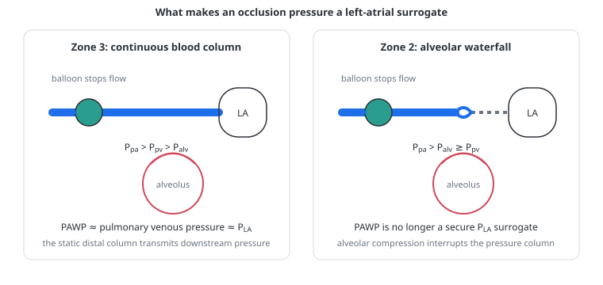

# Pulmonary artery wedge pressure

> A pulmonary artery wedge pressure is a downstream pressure inferred by occluding a pulmonary arterial branch. The model does not perform that occlusion: it displays mean left atrial pressure as a qualified surrogate, which is a useful but narrower claim.

---

## Physiology

### What is actually measured

Inflating the balloon of a pulmonary artery catheter stops flow in a small arterial branch. With no flow, the pressure distal to the balloon equilibrates through the static column of blood in the capillaries and pulmonary veins toward the left atrium. The pressure recorded at the catheter tip is the **pulmonary artery wedge pressure** (PAWP), also called pulmonary artery occlusion pressure.

PAWP is therefore not a direct transduction of the left atrium. It is a pressure transmitted across an occluded vascular path. When that path is unobstructed and the catheter tip lies in a perfused West zone 3 region, mean PAWP is commonly used as a surrogate for mean left atrial pressure. It is not identical to pulmonary capillary pressure, and it is not automatically interchangeable with left ventricular end-diastolic pressure when mitral, pulmonary venous, atrial or ventricular diastolic pathology intervenes.

### Why zone 3 matters

In West zone 3 the pressure order is:

$$
P_{pa} > P_{pv} > P_{alv}
$$

The pulmonary vessels remain open from the occluded branch to the pulmonary veins, so the distal static pressure can track pulmonary venous and left atrial pressure. In zone 2, alveolar pressure exceeds pulmonary venous pressure:

$$
P_{pa} > P_{alv} \ge P_{pv}
$$

The compressed alveolar vessel becomes a vascular waterfall. The continuous pressure column to the left atrium is lost and the occlusion pressure can be governed partly by alveolar pressure rather than by the intended downstream chamber. High lung volume, positive airway pressure and low pulmonary venous pressure make this problem more likely. A real catheter adds regional position, balloon volume, waveform quality and zero-reference errors that the model does not contain.

### The number is absolute pressure, not preload by itself

The transducer reports pressure relative to atmosphere. The pressure distending the left atrium and ventricle is instead referenced to the pressure surrounding the heart. In the simplest form:

$$
P_{LA,tm} = P_{LA} - P_{ext}
$$

- $P_{LA,tm}$ — transmural left atrial pressure, the distending pressure across the atrial wall
- $P_{LA}$ — atmospheric left atrial pressure, approximated clinically by a valid PAWP
- $P_{ext}$ — pressure surrounding the heart, arising mainly from pleural and pericardial pressure

Positive-pressure ventilation can therefore raise measured PAWP while left-heart distension and preload fall. In postoperative patients exposed to increasing PEEP, pulmonary occlusion pressure has been observed to rise while left ventricular end-diastolic area falls; subtracting the measured extracardiac pressure restored the expected relation. Conversely, a vigorous spontaneous inspiration can lower the atmospheric pressure even while the transmural filling pressure rises.

This does not make PAWP useless. It means that the clinical question must be stated: **downstream pulmonary vascular pressure**, **left atrial atmospheric pressure**, and **left-heart transmural filling pressure** are related but not synonymous quantities.

### Its role in heart–lung interaction

PAWP sits at several intersections of respiratory and cardiovascular physiology.

**Pressure transmission.** PEEP and tidal pleural-pressure swings change the atmospheric pressure surrounding the left atrium. A change in PAWP can therefore contain both a change in intracardiac volume and a transmitted external pressure.

**Pulmonary venous return.** Lung inflation can displace blood from the pulmonary vascular reservoir toward the left atrium. That transiently changes left atrial volume and pressure even before altered right ventricular output has crossed the lung.

**Serial ventricular coupling.** A fall in right ventricular output reaches left atrial filling only after [pulmonary transit](pulmonary-transit.md). The wedge response to a breath is therefore not a single instantaneous measure of “preload”; it reflects transmission, pulmonary blood displacement and delayed flow in different proportions over time.

**Pulmonary vascular resistance.** Catheter-derived PVR uses PAWP as its downstream term:

$$
PVR = \frac{mPAP - PAWP}{CO}
$$

An invalid PAWP makes the calculation numerically possible but physiologically uncertain. This is why the model now propagates wedge caution to the derived-PVR tile.

**Pulmonary hypertension phenotype.** PAWP helps separate pre-capillary from post-capillary haemodynamics. Current ESC/ERS definitions use PAWP at or below 15 mmHg together with PVR above 2 WU for pre-capillary pulmonary hypertension, and PAWP above 15 mmHg for post-capillary disease. These thresholds classify a valid invasive haemodynamic measurement in clinical context; they do not validate the model's surrogate.

---

## In the model

### What the tile calculates

There is no catheter, balloon, occluded branch or regional pulmonary venous tree. The left atrium is a compliant chamber whose transmural pressure changes with its volume and atrial activation:

$$
P_{LA,tm}(t) = E_{LA}(t)\left[V_{LA}(t)-V_{0,LA}\right]
$$

The pressure seen relative to atmosphere adds the pressures surrounding the heart:

$$
P_{LA}(t) = P_{LA,tm}(t) + P_{pl}(t) + P_{peri}(t)
$$

- $E_{LA}(t)$ — time-varying atrial elastance
- $V_{LA}$ and $V_{0,LA}$ — current and zero-pressure left atrial volumes
- $P_{pl}$ — pleural pressure converted to mmHg
- $P_{peri}$ — pressure generated by the shared pericardial constraint

The value displayed as **Wedge surrogate** is an exponential three-second mean of this atmospheric left atrial pressure:

$$
P_{w,surr}^{n+1} = P_{w,surr}^{n} + \frac{\Delta t}{3\ \mathrm{s}}\left(P_{LA}^{n}-P_{w,surr}^{n}\right)
$$

This smoothing suppresses atrial and respiratory pulsatility for a readable tile. It is not a simulated catheter waveform, an end-expiratory measurement or an automated selection between the a- and v-waves. The name `paop` in the code is historical; the user-facing label deliberately says **surrogate**.

The separate **LA transmural pressure** tile uses the same three-second interval for all its terms:

$$
\overline{P}_{LA,tm}=\overline{P}_{LA}-\overline{P}_{pl}-\overline{P}_{peri}
$$

Because the averaging rule is identical and subtraction is linear, this is also the three-second mean of the instantaneous pressure across the model atrial wall. It is an exact latent model state, not a bedside measurement reconstructed from an oesophageal catheter.

### How the quality badge is decided

The model cannot identify a regional catheter position. It instead builds a dimensionless **zone 3 index** from the pressure margin between the raw pulmonary venous compartment and alveolar pressure:

$$
I_{Z3} = \operatorname{clamp}\!\left(\frac{P_{pv,raw}-P_{alv}}{4\ \mathrm{mmHg}},\ 0,\ 1\right)
$$

The wedge surrogate is unqualified only when $I_{Z3}\ge0.95$; otherwise it remains visible with a caution. The 4 mmHg scale and 0.95 threshold are conservative model heuristics. The index is **not the percentage of the human lung in zone 3**, which is why the interface no longer calls it a “zone 3 fraction”.

Derived PVR now inherits this caution. If cardiac output is too close to zero for division, derived PVR is unavailable instead. The internal pulmonary resistance coefficient remains separate because it does not use the wedge surrogate.

### Reading a PEEP change in the model

When PEEP rises, follow four quantities rather than the wedge tile alone:

1. **Wedge surrogate** — did atmospheric left atrial pressure rise or fall?
2. **Pleural and pericardial pressure** — how much of that change was external pressure transmission?
3. **Left atrial and ventricular volume or LV pressure–volume loop** — did chamber filling actually increase or decrease?
4. **Zone 3 index and derived-PVR badge** — is the downstream surrogate still defensible for a catheter-like calculation?

The new transmural tile makes the second and third questions easier to separate. Its lack of a zone 3 caution does not validate the wedge: the model knows its own atrial wall pressure exactly even when a real occluded pulmonary arterial branch would no longer transmit left atrial pressure reliably.

### Worked examples

These examples answer the four questions above with complete, reproducible model states. They are collapsed by default so the page can still be read as a physiological explanation rather than as a catalogue of numbers.

<!-- BEGIN GENERATED: wedge-peep-examples -->

Example 1 — normal passive circulation: the wedge rises while filling falls

*Passive volume control, VT 450 mL and 14/min. Each PEEP level is settled independently for 45 s.*

| PEEP (cmH₂O) | wedge surrogate (mmHg) | mean Ppl (mmHg) | mean Pperi (mmHg) | LA transmural (mmHg) | LA volume (mL) | LVEDV (mL) | CO (L/min) | zone 3 index |
|---:|---:|---:|---:|---:|---:|---:|---:|---:|
| 0 | 7.2 | -3.4 | 0.0 | 10.6 | 71 | 132 | 5.58 | 100% |
| 15 | 9.1 | 2.0 | 0.0 | 7.1 | 51 | 117 | 4.90 | 0% |

The wedge surrogate rises by 1.9 mmHg, but LA transmural pressure falls by 3.5 mmHg and LVEDV falls by 15 mL. The higher atmospheric pressure therefore reflects external pressure transmission, not greater left-heart filling. At PEEP 15 the zone 3 index also removes an unqualified catheter-like interpretation.

Example 2 — stiff chest wall: stronger pressure transmission and preload loss

*The same passive breath with chest-wall compliance reduced to 75 mL/cmH₂O. Each PEEP level is settled independently for 45 s.*

| PEEP (cmH₂O) | wedge surrogate (mmHg) | mean Ppl (mmHg) | mean Pperi (mmHg) | LA transmural (mmHg) | LA volume (mL) | LVEDV (mL) | CO (L/min) | zone 3 index |
|---:|---:|---:|---:|---:|---:|---:|---:|---:|
| 0 | 7.0 | -3.1 | 0.0 | 10.1 | 68 | 131 | 5.53 | 100% |
| 15 | 9.1 | 4.9 | 0.0 | 4.2 | 32 | 97 | 3.99 | 0% |

The stiffer thoracic envelope transmits a larger pressure rise around the heart. LA transmural pressure falls by 6.0 mmHg, LVEDV by 33 mL and output by 1.54 L/min despite the higher wedge surrogate.

Example 3 — LV failure: PEEP can lower congestion and raise output

*The LV-failure preset, compared at PEEP 0 and 10 cmH₂O. Each PEEP level is settled independently for 45 s.*

| PEEP (cmH₂O) | wedge surrogate (mmHg) | mean Ppl (mmHg) | mean Pperi (mmHg) | LA transmural (mmHg) | LA volume (mL) | LVEDV (mL) | CO (L/min) | zone 3 index |
|---:|---:|---:|---:|---:|---:|---:|---:|---:|
| 0 | 39.0 | -2.8 | 2.3 | 39.5 | 245 | 131 | 1.61 | 100% |
| 10 | 37.1 | 2.6 | 0.6 | 33.9 | 209 | 127 | 1.88 | 100% |

Here the wedge surrogate falls by 1.9 mmHg while output rises by 0.27 L/min. This is not recruitment of preload: it is the preset's intended afterload-dominant response, in which higher pleural pressure reduces the transmural load faced by the failing LV.

Example 4 — severe underfilling: the number remains visible after its catheter meaning weakens

*The normal passive setup with stressed volume reduced to 300 mL. Each PEEP level is settled independently for 45 s.*

| PEEP (cmH₂O) | wedge surrogate (mmHg) | mean Ppl (mmHg) | mean Pperi (mmHg) | LA transmural (mmHg) | LA volume (mL) | LVEDV (mL) | CO (L/min) | zone 3 index |
|---:|---:|---:|---:|---:|---:|---:|---:|---:|
| 0 | 2.3 | -3.4 | 0.0 | 5.7 | 42 | 107 | 4.42 | 51% |
| 15 | 5.1 | 2.0 | 0.0 | 3.0 | 26 | 83 | 3.24 | 0% |

The wedge surrogate rises by 2.8 mmHg while LA transmural pressure, LVEDV and output all fall. The zone 3 index is already 51% at zero PEEP and falls further with PEEP, so both wedge and derived PVR must be read with caution throughout this comparison.

<!-- END GENERATED: wedge-peep-examples -->

---

## Why this and not something else

Using left atrial pressure keeps the closed-loop model compact and makes pulmonary venous pressure respond to real chamber volume, external pressure and delayed pulmonary flow. A scripted “wedge” offset would produce a plausible number without explaining where it came from.

A genuine occlusion model would require at least a regional catheter branch, a static distal vascular column, alveolar pressure around that branch and a sampling convention within the cardiac and respiratory cycles. Adding only a balloon button to the current lumped pulmonary bed would imply a measurement fidelity the topology cannot support. The present implementation therefore keeps the useful downstream signal, renames it honestly and qualifies the conditions under which it resembles PAWP.

---

## Limits

### Of the construction

- No regional catheter position, balloon inflation, overwedging, underwedging or waveform-recognition error.
- No mitral stenosis or regurgitation, pulmonary venous obstruction, atrial fibrillation or large pathological v-waves.
- No separate pulmonary capillary pressure; the wedge surrogate must not be used as a hydrostatic oedema threshold.
- No end-expiratory sampling. The tile is a three-second low-pass mean of left atrial pressure.
- The zone 3 index is one pressure-margin heuristic in a non-regional lung, not an anatomical perfusion map.
- The model calculates left atrial pressure exactly from its own state, but exact knowledge of a latent model variable is not equivalent to clinical measurement accuracy.

### Of clinical application

- A value above or below 15 mmHg is not diagnostic when the wedge tracing or zone assumptions are invalid, and the threshold itself must be interpreted with phenotype and measurement context.
- Atmospheric PAWP should not be read as left ventricular preload without considering pleural and pericardial pressure, especially during PEEP, vigorous effort, obesity or dynamic hyperinflation.
- PAWP, LVEDP and mean left atrial pressure can diverge in diseases absent from the model.
- The model's pulmonary hypertension label is descriptive. It cannot replace right-heart catheterisation, waveform review or clinical classification.

---

## Validation

Contract tests require a zone-3 state to leave both the wedge surrogate and derived PVR unqualified, and a waterfall state to apply the same caution to both. Scenario and literature tests separately verify the pre- and post-capillary classification logic when the surrogate remains admissible.

These checks establish internal consistency: they do not validate the model surrogate against paired human PAWP and left atrial measurements.

---

## References

- Humbert M, Kovacs G, Hoeper MM, et al. 2022 ESC/ERS Guidelines for the diagnosis and treatment of pulmonary hypertension. *Eur Heart J*. 2022;43:3618–3731. [doi:10.1093/eurheartj/ehac237](https://doi.org/10.1093/eurheartj/ehac237)
- West JB, Dollery CT, Naimark A. Distribution of blood flow in isolated lung; relation to vascular and alveolar pressures. *J Appl Physiol*. 1964;19:713–724. [doi:10.1152/jappl.1964.19.4.713](https://doi.org/10.1152/jappl.1964.19.4.713)
- Pinsky MR, Vincent JL, De Smet JM. Estimating left ventricular filling pressure during positive end-expiratory pressure in humans. *Am Rev Respir Dis*. 1991;143:25–31. [doi:10.1164/ajrccm/143.1.25](https://doi.org/10.1164/ajrccm/143.1.25)
- Smiseth OA, Thompson CR, Ling H, Robinson M, Miyagishima RT. Juxtacardiac pleural pressure during positive end-expiratory pressure ventilation: an intraoperative study in patients with open pericardium. *J Am Coll Cardiol*. 1994;23:753–758. [doi:10.1016/0735-1097(94)90764-1](https://doi.org/10.1016/0735-1097(94)90764-1)
- Kovacs G, Avian A, Pienn M, Naeije R, Olschewski H. Reading pulmonary vascular pressure tracings: how to handle the problems of zero leveling and respiratory swings. *Am J Respir Crit Care Med*. 2014;190:252–257. [doi:10.1164/rccm.201402-0269PP](https://doi.org/10.1164/rccm.201402-0269PP)

---

## See also

[Numerical tiles](numeric-tiles.md) · [Interpretability](interpretability.md) · [Transmural pressure](transmural-pressure.md) · [Vascular waterfalls](vascular-waterfalls.md) · [Pulmonary vascular resistance](pulmonary-vascular-resistance.md) · [Pulmonary transit](pulmonary-transit.md) · [The four effects of a breath](the-four-effects-of-a-breath.md)
