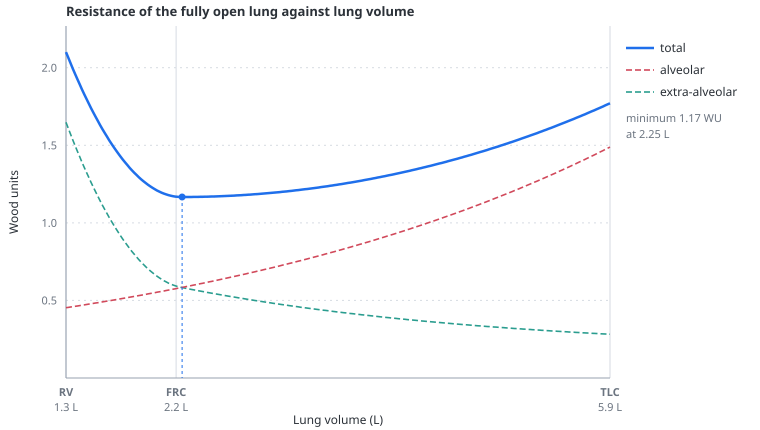

# Pulmonary vascular resistance and the J-curve

> Pulmonary vascular resistance changes with lung volume because alveolar and extra-alveolar vessels respond to inflation in opposite directions. In the model, their combined mechanical contribution is minimal near functional residual capacity, so both derecruitment and overdistension can load the right ventricle.

---

## Physiology

The pulmonary vascular bed can be divided functionally into vessels exposed predominantly to alveolar pressure and vessels supported by extra-alveolar tissue. They differ in surroundings, structure and calibre; the model retains only the distinction in their mechanical response to inflation. See [transmural pressure](transmural-pressure.md).

**Alveolar vessels** are the septal capillaries running in the alveolar wall. The pressure surrounding them is alveolar pressure. As the alveolus inflates, the septum is stretched and flattened, and these vessels are compressed. Their resistance therefore **rises with inflation**.

**Extra-alveolar vessels** are the arterioles and venules travelling in the interstitium between alveoli, along with the larger intraparenchymal vessels. The pressure surrounding them is interstitial pressure, which falls as the lung expands, and they are additionally held open by **radial traction** from the parenchyma attached to their adventitia. Inflating the lung pulls them open. Their resistance therefore **falls with inflation** — and, conversely, collapses toward residual volume as traction is lost.

Total resistance is the series sum of the two segments:

$$
R_{\text{total}}(V) = R_{\text{alveolar}}(V) + R_{\text{extra-alveolar}}(V)
$$

- $V$ — lung volume
- $R_{\text{alveolar}}$ — resistance of the septal capillaries, which rises with inflation
- $R_{\text{extra-alveolar}}$ — resistance of the interstitial vessels, which falls with inflation

Because the two terms have opposite slopes, the sum has a minimum. Above it, alveolar compression dominates; below it, loss of radial traction does. This is the J-curve — or, drawn symmetrically, the U-curve.

### Why the mechanical curve uses volume

Radial traction is generated by stress in the parenchyma, so transpulmonary pressure is an intuitively attractive horizontal axis. Pressure and volume are not interchangeable during inflation and deflation, however: the lung's own pressure-volume hysteresis lets the same pressure produce different volumes. That separation provides an experimental way to ask which variable better organises the mechanical resistance data.

| if resistance mainly tracks… | plotted against lung volume | plotted against transpulmonary pressure |
|---|---|---|
| **volume** | inflation and deflation approach one relation | a loop may remain because equal pressure does not imply equal volume |
| **pressure** | a loop may remain because equal volume does not imply equal pressure | inflation and deflation approach one relation |

This is a test of which variable is the better **state descriptor in that preparation**, not proof that pressure has no vascular effect.

Thomas, Griffo and Roos used static negative-pressure inflation in 55 excised dog lungs while holding vascular pressures constant. Resistance showed marked inflation-history dependence when plotted against transpulmonary pressure but was relatively consistent when plotted against volume. Hakim, Michel and Chang then compared positive- and negative-pressure inflation in isolated canine lobes and separated arterial, middle and venous pressure drops: they found similar small volume-related increases in alveolar and extra-alveolar resistance, superimposed on pressure-related effects that differed with inflation mode and vascular reference pressure. Peták and colleagues later showed the importance of that distinction directly: over the same 2.5–22 cmH₂O transpulmonary-pressure sweep, total resistance rose by 15 ± 1% with positive-pressure inflation but fell slightly (−3 ± 0.3%) with negative-pressure expansion in isolated perfused rat lungs.

The model therefore uses **strain—volume per open unit—to shape the two mechanical limbs**, while representing the main pressure-specific mechanism separately through the alveolar waterfall. Pressure still matters: it determines volume through lung mechanics, changes transmural vascular pressures and can replace pulmonary venous pressure as the effective downstream pressure. The choice is not “volume matters and pressure does not”; it is “do not make transpulmonary pressure stand in for every mechanism at once.”

Three further mechanisms load the low-volume limb in a real patient, and the J-curve of the *mechanically* open lung is only part of the story:

- **Hypoxic vasoconstriction.** Collapsed units are hypoxic, and their vessels constrict. See [hypoxic vasoconstriction](hypoxic-vasoconstriction.md).
- **The alveolar waterfall.** Where alveolar pressure exceeds pulmonary venous pressure, the alveolar segment behaves as a Starling resistor: the effective downstream pressure becomes alveolar rather than venous, and lowering venous pressure further cannot increase flow. This is West zone 2, and it is the same physics as caval collapse on the venous side — see [vascular waterfalls](vascular-waterfalls.md).
- **Derecruitment itself** removes vascular pathway, so the remaining open lung carries the whole cardiac output.

### Why this matters at the bedside

The right ventricle is a thin-walled pump that tolerates volume far better than pressure — see [the right ventricle](the-right-ventricle.md). Its afterload is minimised near FRC, and *both* directions away from FRC raise it. This is the mechanical basis of the observation that ventilating an injured lung can cause acute cor pulmonale, and of the practice of limiting plateau and driving pressure for reasons that have nothing to do with alveolar rupture.

It also explains a clinical trap: raising PEEP in a poorly recruitable lung moves the aerated units up the *right* limb without opening anything, so resistance rises. In a recruitable lung the same PEEP moves collapsed units onto the curve at all, and resistance can fall or stay flat. The PEEP response of pulmonary resistance therefore **interacts with recruitability**; it is not a specific test of recruitability by itself. See [recruitment and R/I](recruitment-and-ri.md) and [ARDS with right ventricular failure](scenarios.md#ards-with-right-ventricular-failure).

---

## In the model

The scale of the whole bed is set by one control, `pvrBase` — see [pulmonary circulation controls](controls-pulmonary.md). Everything below shapes that scale as a function of lung volume; nothing below introduces a second adjustable magnitude.

### Strain, not absolute volume

The limbs are driven by **volume per open unit**, expressed as a strain:

$$
\varepsilon = \frac{V}{V_{\text{unit}} \cdot \varphi} - 1
$$

where $V$ is absolute lung volume, $\varphi$ the open fraction, and $V_{\text{unit}}$ the volume this patient's aerated tissue would hold at resting recoil. That reference follows both aerated-lung compliance and maximum capacity. A small aerated lung can therefore be **distended** at an absolute volume well below a healthy 2.2 L FRC. Referencing strain to a fixed healthy FRC would make that lung appear under-inflated at high plateau pressure, which is the opposite of what it is. See [the two-population lung](two-population-lung.md) for how $\varphi$ and $V_{\text{unit}}$ are obtained.

### The two limbs

For the open population, per unit of lung:

$$
R_{\text{alv}} = P \cdot f_a \, e^{k\varepsilon}
$$

$$
R_{\text{extra}} = P \cdot \Big[ f_e \big( c + (1-c)\,e^{-K\varepsilon} \big) + G \cdot \max(0, -\varepsilon)^2 \Big]
$$

- $\varepsilon$ — strain, defined above; zero at resting recoil, negative below it
- $P$ — the `pvrBase` control, which sets the scale of the whole bed
- $f_a = f_e = 0.5$ — the shares of resting resistance assigned to each segment
- $k = 0.58$ — how steeply the alveolar limb rises with stretch
- $c = 0.30$ — the floor the extra-alveolar limb decays toward as the lung inflates
- $G = 4$ — the gain of the low-volume traction term, active only below resting recoil

$K$ is **derived rather than chosen**. Requiring the total to be stationary at $\varepsilon = 0$ gives

$$
\frac{dR}{d\varepsilon}\bigg|_{0} = P\big(f_a k - f_e(1-c)K\big) = 0
\quad\Longrightarrow\quad
K = \frac{f_a k}{f_e (1-c)} = 0.829
$$

so the minimum sits at zero strain by construction, not by tuning. The quadratic $G$ term is zero in both value and slope at $\varepsilon = 0$, so it steepens the left limb without moving that minimum or changing the resistance assigned there.

Zero strain means the volume the completely open tissue holds at resting recoil, which for the default lung is 2.25 L against a nominal whole-lung FRC of 2.2 L. The small difference is the residual opening behaviour of normal units at 5 cmH₂O; the executable row below allows 0.15 L between them.

### Open and closed beds in parallel

Derecruited units are poorly perfused, not unperfused. Each population's conductance is proportional to how much lung belongs to it, and conductances add:

$$
\frac{1}{R_{\text{total}}} = \frac{\varphi}{R_{\text{open}}} + \frac{1-\varphi}{R_{\text{closed}}},
\qquad R_{\text{closed}} = P \cdot 3 \cdot \big(1 + 1.1\,h\big)
$$

- $\varphi$ — open fraction of the lung, so $1-\varphi$ is the derecruited fraction
- $R_{\text{open}}$ — resistance per unit of open lung, the series sum of the two limbs above
- $R_{\text{closed}}$ — resistance per unit of derecruited lung
- $P$ — the `pvrBase` control
- $h$ — the [hypoxic vasoconstriction](hypoxic-vasoconstriction.md) control

HPV raises **only the closed pathway** — the model has no gas exchange, so hypoxia is represented by where the blood goes, not by a measured PaO₂.

### The waterfall applies to a share, not the whole lung

Only the alveolar microvascular share sees an alveolar waterfall. The effective downstream pressure of the pulmonary circuit is

$$
P_{\text{down}} = (1-w)\,P_{pv} + w \cdot \max(P_{pv},\, P_{alv}), \qquad w = 0.45
$$

- $P_{pv}$ — pulmonary venous pressure, mmHg
- $P_{alv}$ — alveolar pressure, mmHg
- $w$ — share of the bed exposed to alveolar pressure

### What the fully open normal lung does

| | RV (1.31 L) | FRC (2.20 L) | TLC (6.00 L) |
|---|---|---|---|
| total | 2.03 WU | **1.17 WU** | 1.81 WU |
| relative to the minimum | 1.74× | 1.00× | 1.55× |
| extra-alveolar ÷ alveolar | 3.43 | 1.03 | 0.18 |

The crossover — the volume at which the dominant mechanism changes — sits at FRC, which is the teaching point the figure exists to make.

The point labelled “RV” is the model's low-volume reference at zero transpulmonary pressure. Residual volume is not independently modelled, so the label should not be interpreted as a predicted physiological RV.

### Two numbers that are not the same number

The model reports pulmonary resistance twice, and they are different kinds of quantity. This distinction is the subject of [interpretability](interpretability.md).

- **Pulmonary resistance coefficient** — the model's own internal $R$, the thing the equations divide by. Not measurable in a patient, and not a Poiseuille resistance.
- **PVR, derived** — $(\overline{P}_{pa} - P_{la})/\dot{Q}$, computed from mean pulmonary arterial pressure, model left atrial pressure and cardiac output. It has the form of catheter PVR only while left atrial pressure is a defensible [wedge surrogate](pulmonary-artery-wedge-pressure.md), and now inherits that tile's caution automatically.

They can move in opposite directions, because the derived value carries cardiac output in its denominator. In the calibration phenotype, PEEP 4 → 14:

| | coefficient | derived | open fraction |
|---|---|---|---|
| R/I 0.05 (poorly recruitable) | 2.38 → 2.36 WU (−1%) | 2.64 → **3.16 WU (+20%)** | 58 → 59% |
| R/I 0.50 (recruitable) | 2.38 → 2.22 WU (−7%) | 2.54 → 2.64 WU (+4%) | 58 → 64% |

Reading the coefficient as though it were the pressure–flow estimate would report the opposite direction. However, at PEEP 14 these model runs fall outside the zone III assumption and the wedge surrogate is flagged. The table therefore demonstrates an internal pressure–flow response and its dependence on recruitability; it does not independently reproduce a valid catheter measurement at both PEEP levels. The earlier coefficient/derived-value confusion is written up in [the postmortem](../docs/POSTMORTEM-2026-08-09.md).

---

## Why this and not something else

### The minimum is placed at FRC, and this is a genuine choice

Earlier versions put the minimum at 2.87 L — 48% of maximal volume — following primary measurements in excised and isolated animal lungs, which locate it at roughly half of maximal volume, above FRC. Common clinical schematics draw it *at* or near FRC.

The model now follows the clinical schematic because the former ARDS phenotype produced roughly 10–16 WU, far outside the approximately 1.5–4.75 WU span of the relevant human cohort measurements. That excess did **not** have one cause:

| earlier construction | consequence | current construction |
|---|---|---|
| resistance divided by open fraction | closed units were effectively removed rather than poorly perfused | open and closed conductances remain in parallel |
| HPV multiplied the whole pulmonary bed | hypoxic tone amplified even the aerated pathway | HPV acts only on the derecruited pathway |
| one pressure crossing activated a whole-bed waterfall | a regional phenomenon became an all-or-none jump | only a fixed alveolar share sees the waterfall |
| nadir fixed at 2.87 L | the low-volume ARDS lung sat far down the steep animal left limb | zero strain places the open-lung minimum near its resting volume |

All four changes were made in the same revision, so the fall from 10–16 WU cannot be attributed retrospectively to the nadir alone. The evidence hierarchy is therefore explicit:

1. **Human in-vivo catheter measurements** constrain the approximate magnitude and recruitability-dependent PEEP response.
2. **The contemporary clinical synthesis** supplies the human teaching topology: a minimum near FRC with resistance rising toward both lower and higher volume.
3. **Isolated-animal preparations** support volume dependence and the existence of opposing mechanical effects, but their exact nadir and maximal-inflation ratios are not numerical human targets.

The nadir is consequently at FRC *by construction*—$K$ is solved to put it there—not because the model discovered or fitted its location. The model cannot be used to ask where the human nadir truly belongs, and anyone teaching from the figure should state that boundary.

### Both limbs follow volume, not transpulmonary pressure

The experimental argument is described [above](#why-the-mechanical-curve-uses-volume). It supports volume as the better organising variable for the model's **mechanical curve**, not a pressure-free pulmonary circulation. Driving the extra-alveolar limb directly with transpulmonary pressure once caused one pressure signal to carry parenchymal geometry, vessel transmural pressure and waterfall behaviour simultaneously. Using strain for the curve and keeping the waterfall separate preserves those distinctions. Hakim's and Peták's inflation-mode results are the reason this qualification matters: pressure-related effects remain real even when volume better organises the underlying mechanical relation.

### Conductances in parallel, not a divided single path

Representing the two populations as parallel conductances is what allows a derecruited unit to be *poorly* perfused rather than absent, and keeps HPV acting where hypoxia is. It also removes the discontinuity that made whole-lung resistance jump when a mean pressure crossed a threshold.

### Coefficients that are declared rather than cited

Several numbers here are **didactic shape coefficients**: they were chosen to express a physiological principle that is well established but has never been quantified in a form portable to a human aggregate model. They carry no citation because attaching one would misrepresent them.

| | value | what it does |
|---|---|---|
| $f_a : f_e$ | 50 : 50 | where the dominant mechanism changes |
| $k$, $c$ | 0.58, 0.30 | how gradually each limb rises |
| $G$ | 4 | the nonlinear left limb below FRC |
| closed-path factor | 3 | how much narrower a derecruited pathway is |

The equal split deserves a word, because it looks like something that could be measured and is not. Published partitions of the pulmonary bed do not measure the same boundary and do not agree — the alveolar share has been reported below 16% by occlusion, 34% by indicator dilution and 45% by micropuncture, and the middle distensible segment alone swings from 7% to 53% with haematocrit. No measurement settles it. Equal shares at FRC are a didactic crossover, not an anatomical claim. The 45% waterfall share is the upper end of that same reported range and is likewise an aggregate.

The closed-path factor and phenotype were constrained jointly against the numerical pattern of a human PEEP study. Because the model uses left atrial pressure as the downstream pressure even when its wedge surrogate is cautioned, this is calibration of an internal phenotype rather than independent validation of catheter-derived PVR.

---

## Limits

### Of the construction

- One aggregate bed. There is no regional zonal network, no gravitational gradient, no distribution of transit paths through parallel regions. West zones appear as a fractional share, not as a map.
- No pressure- or flow-dependent vascular recruitment and distension. Real PVR falls as pulmonary arterial pressure or flow rises; here it depends on lung volume and open fraction only.
- No blood rheology. Viscosity and haematocrit do not exist, although the partition they most affect is one of the model's chosen constants.
- No vascular remodelling, characteristic impedance or wave reflection. The pulmonary circuit is resistive and compliant, not pulsatile in the vascular sense. Pressure propagation is instantaneous; only volume delivery is delayed, by [pulmonary transit](pulmonary-transit.md).
- HPV is a gain applied to the derecruited pathway, not a response to a measured oxygen tension. There is no gas exchange, no V/Q, no CO₂.
- The secondary high-volume rise found outside the alveolar segment in isolated lobes is not represented; the clinical two-limb decomposition is followed instead.
- The minimum is at FRC by construction. See the caveat above.

### Of clinical application

- **Do not read the coefficient as a patient's PVR.** It is an internal quantity. The value labelled *derived* is comparable in form to catheter PVR only when the left-atrial-pressure wedge surrogate is valid.
- **The absolute pressure–flow values are calibrated in one phenotype**, at PEEP 4–14, against one human ARDS cohort. The high-PEEP rows are outside the model's zone III assumption, so this should not be described as catheter-level validation. Elsewhere in the control space the model is directionally interpretable and quantitatively unvalidated.
- **This is not a PEEP titration tool.** R/I is not a prescription, a high R/I does not establish that high PEEP is safe, and the model deliberately does not turn the PEEP response of resistance into a recommendation.
- **In the pulmonary embolism preset**, a raised `pvrBase` is an *effective aggregate load*. It reproduces the pressure, flow and right-ventricular consequences of obstruction without representing clot burden, embolic distribution or a right-shifted pressure–flow relation as separate quantities. See [acute pulmonary embolism](scenarios.md#acute-pulmonary-embolism).
- Nothing here defends right ventricular **coronary** perfusion, which is absent from the model and is a real part of the clinical spiral.

---

## Validation

Five rows in [`LITERATURE_RANGES.md`](../docs/LITERATURE_RANGES.md) are executed by the test suite against this page's behaviour, and fail the build if the model drifts. See [validation](validation.md) for what a green row means.

| row | constrains |
|---|---|
| `pvr-human-frc-nadir` | the minimum lies within 0.15 L of FRC |
| `pvr-human-j-direction` | higher at RV and TLC than at FRC; extra-alveolar predominates at RV, alveolar at TLC |
| `pvr-recruitability-low` | model pressure–flow estimate inside the low-recruiter IQRs, rising with PEEP |
| `pvr-recruitability-high` | model pressure–flow estimate inside the high-recruiter IQRs, near-flat with PEEP |
| `pvr-recruitability-dissociation` | across R/I 0 → 0.8, the PEEP-related rise is progressively attenuated |

The first two are topological: they test the shape, not a fitted number, because the shape is what this page teaches and the schematic it follows has no quantitative y-axis. The cohort-range tests are regression constraints on the chosen phenotype, not proof that the downstream pressure is measurable as a wedge under every tested condition.

---

## References

**Design sources**

- Cecconi M, Collino F, Pinsky MR. Heart–lung interactions in ARDS. *Intensive Care Med* 2026. [doi:10.1007/s00134-026-08583-3](https://doi.org/10.1007/s00134-026-08583-3) — Fig. 1C is the clinical two-limb synthesis this page follows.
- Mahmood SS, Pinsky MR. Heart–lung interactions during mechanical ventilation. *Ann Transl Med* 2018;6:349.
- Kenny J-ÉS. *An Approach to Mechanical Heart–Lung Interaction*, 2020.
- Yuriditsky E, Mireles-Cabodevila E, Alviar CL. *ATS Scholar* 2025;6:94–108.

**Volume dependence of pulmonary vascular resistance**

- Thomas LJ, Griffo ZJ, Roos A. [Effect of negative-pressure inflation of the lung on pulmonary vascular resistance](https://doi.org/10.1152/jappl.1961.16.3.451). *J Appl Physiol* 1961;16:451–6. Excised dog lungs; resistance minimal near half maximal volume, rising on either further inflation or deflation.
- Whittenberger JL, McGregor M, Berglund E, Borst HG. [Influence of state of inflation of the lung on pulmonary vascular resistance](https://doi.org/10.1152/jappl.1960.15.5.878). *J Appl Physiol* 1960;15:878–82.
- Hakim TS, Michel RP, Chang HK. [Effect of lung inflation on pulmonary vascular resistance by arterial and venous occlusion](https://doi.org/10.1152/jappl.1982.53.5.1110). *J Appl Physiol* 1982;53:1110–5. Positive- and negative-pressure inflation separated volume-related from pressure-reference effects.
- Hakim TS, Michel RP, Chang HK. [Partitioning of pulmonary vascular resistance in dogs by arterial and venous occlusion](https://doi.org/10.1152/jappl.1982.52.3.710). *J Appl Physiol* 1982;52:710–5. Methodological basis for the segmental pressure-drop partition.
- Peták F, Albu G, Lele E, et al. [Lung mechanical and vascular changes during positive- and negative-pressure lung inflations: importance of reference pressures in the pulmonary vasculature](https://doi.org/10.1152/japplphysiol.00831.2007). *J Appl Physiol* 2009;106:935–42.
- Simmons DH, Linde LM, Miller JH, O'Reilly RJ. [Relation between lung volume and pulmonary vascular resistance](https://doi.org/10.1161/01.RES.9.2.465). *Circ Res* 1961;9:465–71.

**The waterfall and zonal behaviour**

- West JB, Dollery CT, Naimark A. [Distribution of blood flow in isolated lung; relation to vascular and alveolar pressures](https://doi.org/10.1152/jappl.1964.19.4.713). *J Appl Physiol* 1964;19:713–24.
- Permutt S, Bromberger-Barnea B, Bane HN. Alveolar pressure, pulmonary venous pressure and the vascular waterfall. *Med Thorac* 1962;19:239–60.

**Hypoxic vasoconstriction**

- von Euler US, Liljestrand G. Observations on the pulmonary arterial blood pressure in the cat. *Acta Physiol Scand* 1946;12:301–20.
- Sylvester JT, Shimoda LA, Aaronson PI, Ward JPT. [Hypoxic pulmonary vasoconstriction](https://doi.org/10.1152/physrev.00041.2010). *Physiol Rev* 2012;92:367–520.

**Human in-vivo calibration and clinical consequence**

- Cappio Borlino S, et al. [The effect of positive end-expiratory pressure on pulmonary vascular resistance depends on lung recruitability in patients with acute respiratory distress syndrome](https://doi.org/10.1164/rccm.202402-0383OC). *Am J Respir Crit Care Med* 2024;210:900–7. The source of the four absolute values this page is calibrated against.
- Chen L, Del Sorbo L, Grieco DL, et al. [Potential for lung recruitment estimated by the recruitment-to-inflation ratio in ARDS: a clinical trial](https://doi.org/10.1164/rccm.201902-0334OC). *Am J Respir Crit Care Med* 2020;201:178–87.
- Mekontso Dessap A, et al. [Acute cor pulmonale during protective ventilation for ARDS: prevalence, predictors and clinical impact](https://doi.org/10.1007/s00134-015-4141-2). *Intensive Care Med* 2016;42:862–70.
- Paternot A, Repessé X, Vieillard-Baron A. [Rationale and description of right ventricle-protective ventilation in ARDS](https://doi.org/10.4187/respcare.04943). *Respir Care* 2016;61:1391–6.

---

## See also

[The two-population lung](two-population-lung.md) · [Recruitment and R/I](recruitment-and-ri.md) · [Vascular waterfalls](vascular-waterfalls.md) · [Hypoxic vasoconstriction](hypoxic-vasoconstriction.md) · [The right ventricle](the-right-ventricle.md) · [Transmural pressure](transmural-pressure.md) · [Interpretability](interpretability.md) · [The PVR curve panel](panel-pvr-curve.md) · [ARDS with right ventricular failure](scenarios.md#ards-with-right-ventricular-failure)
