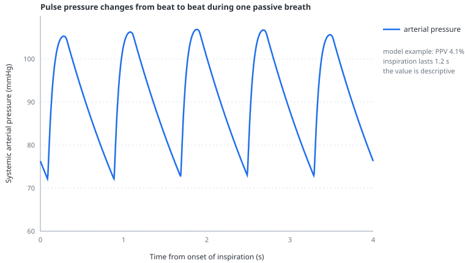
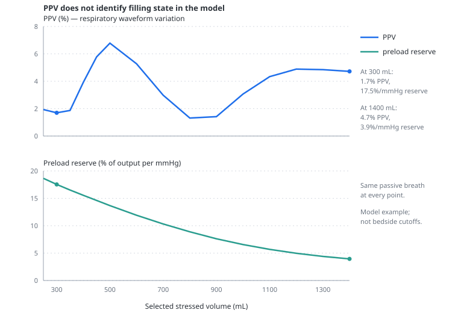

# Pulse pressure variation

> PPV describes how arterial pulse pressure changes over a breath; under strict conditions that variation can reflect biventricular preload responsiveness, but the model does not turn it into a fluid-response diagnosis.

---

## Physiology

Pulse pressure is systolic minus diastolic arterial pressure for one beat. During passive positive-pressure ventilation, inspiration changes venous return, right-ventricular filling, pulmonary vascular load and left-ventricular filling in sequence. If both ventricles operate on the ascending part of their cardiac function curves, these cyclic changes produce a larger swing in stroke volume and pulse pressure.

PPV is conventionally calculated over one respiratory cycle:

$$
PPV = 100\,\frac{PP_{max}-PP_{min}}{\left(PP_{max}+PP_{min}\right)/2}
$$

- $PPV$ — pulse pressure variation, %
- $PP_{max}$ — largest beat pulse pressure during the respiratory cycle, mmHg
- $PP_{min}$ — smallest beat pulse pressure during the respiratory cycle, mmHg

The formula is simple; the physiology is not. The right-sided perturbation reaches the left ventricle only after [pulmonary transit](pulmonary-transit.md). Direct inspiratory emptying of pulmonary venous blood can briefly increase LV filling, while a later fall in RV output can reduce it. The resulting maximum and minimum depend on the ratio of heart rate to respiratory rate as well as on loading.

Large PPV is not synonymous with hypovolaemia. Right-ventricular dysfunction or a large cyclic increase in pulmonary vascular load can create a false positive. Low tidal volume can create a false negative. Spontaneous or irregular effort, arrhythmia, abdominal hypertension and too few beats per breath further weaken the interpretation.

---

## In the model

The simulator records systolic and diastolic pressure for each completed model beat. It takes the beats within the most recent respiratory cycle, calculates pulse pressure for each, and applies the standard formula above. If fewer than two beats are available it returns zero while waiting rather than inventing variation.

PPV remains a descriptive number, accompanied by [interpretability](interpretability.md):

- spontaneous effort makes it **unavailable**;
- delivered VT below 560 mL — 8 mL/kg for the fixed <!-- CONSISTENCY: reference-weight -->70 kg<!-- /CONSISTENCY --> reference — produces a **caution**;
- fewer than 3.6 beats per breath produces a **caution**;
- RV/LV end-diastolic volume ratio above 1.2 produces a **caution** because afterload may dominate;
- abdominal pressure above 12 cmH₂O produces a **caution**.

The model has no arrhythmia, so regular rhythm is always present and cannot be checked. Low respiratory-system compliance is not by itself a badge rule, although the simulator exposes the within-breath PVR swing and RV dilatation that can reveal the mechanism.

An earlier version used a 13% threshold and was tuned against the Michard 2000 cohort. That was retired: the study's ventilation and population do not justify transporting one regression into every scenario. The tidal-volume challenge was also removed because applying it to an incompletely calibrated PPV amplitude could create a convincing but model-specific false result.

The model's PPV is non-monotonic at **both** ends of the filling range.

At severe underfilling, a small PPV can coexist with marked [preload reserve](preload-reserve.md). Two represented mechanisms contribute. First, pulmonary venous pressure is too low to keep the pulmonary vessels open along their full length: this is outside zone 3, so inflation cannot squeeze much blood forward and the piston contribution almost disappears. Second, low cardiac output lengthens transit through the compliant pulmonary circulation, which can blunt the right-sided variation before it appears in left-ventricular output. The arterial waveform can therefore vary little even though more filling would raise output substantially. This is a quantitative limitation of the model, **not** a clinical rule about profound hypovolaemia.

At the filled end, the opposite problem appears. Once nearly all pulmonary vessels are in zone 3, inflation can squeeze blood toward the left atrium and raise PPV again even when additional filling buys little output. The figure places the model's PPV above its independent preload-reserve readout across the same filling sweep.

The practical reading is deliberately simple: neither a low nor a high model PPV identifies filling state or fluid responsiveness. Use PPV to observe respiratory waveform variation; use preload reserve to ask whether additional filling would raise model output.

---

## Why this and not something else

Removing PPV entirely would discard one of the clearest demonstrations of heart–lung interaction. Keeping the waveform calculation while removing the diagnostic verdict preserves the useful observation: ventilation changes arterial pulse amplitude, and the mechanism depends on loading, timing and RV afterload.

The simulator does not normalise PPV for tidal volume, compliance or driving pressure. Such corrections may improve performance in selected studies but would imply a quantitative calibration the model does not possess.

---

## Limits

### Of the construction

- Rhythm and respiratory effort are perfectly regular; arrhythmia, trigger asynchrony and variable effort are absent.
- Pulse pressure comes from one lumped systemic arterial compliance with no wave reflection, peripheral amplification or damping by an arterial catheter system.
- The model represents cyclic RV afterload through an aggregate pulmonary bed, not regional ARDS perfusion.
- The 70 kg reference used for the tidal-volume caution is fixed and is not a patient weight control.
- The model's PPV amplitude is not calibrated across disease populations.

### Of clinical application

- No PPV value in the simulator should trigger fluid administration.
- A low value does not exclude preload responsiveness under low VT or weak cardiopulmonary transmission.
- A high value can reflect RV afterload, abdominal pressure or other confounding mechanisms rather than preload reserve.
- The value is deliberately unavailable during spontaneous breathing even though a mathematical respiratory variation still exists.

---

## Validation

Executable checks require PPV to be withheld during spontaneous breathing, qualified at low tidal volume and with RV dilatation, and prevented from masquerading as preload reserve when pulmonary venous piston effects raise variation at high filling. Separate tests require the timing of the LV response to remain consistent with pulmonary transit.

---

## References

- Michard F, Boussat S, Chemla D, et al. Relation between respiratory changes in arterial pulse pressure and fluid responsiveness in septic patients with acute circulatory failure. *Am J Respir Crit Care Med*. 2000;162:134–138. [doi:10.1164/ajrccm.162.1.9903035](https://doi.org/10.1164/ajrccm.162.1.9903035)
- De Backer D, Heenen S, Piagnerelli M, Koch M, Vincent JL. Pulse pressure variations to predict fluid responsiveness: influence of tidal volume. *Intensive Care Med*. 2005;31:517–523. [doi:10.1007/s00134-005-2586-4](https://doi.org/10.1007/s00134-005-2586-4)
- Mahjoub Y, Pila C, Friggeri A, et al. False-positive pulse pressure variation is detected by Doppler evaluation of the right ventricle. *Crit Care Med*. 2009;37:2570–2575. [doi:10.1097/CCM.0b013e3181a380a3](https://doi.org/10.1097/CCM.0b013e3181a380a3)
- Vieillard-Baron A, Chergui K, Augarde R, et al. Cyclic changes in arterial pulse during respiratory support revisited by Doppler echocardiography. *Am J Respir Crit Care Med*. 2003;168:671–676. [doi:10.1164/rccm.200301-135OC](https://doi.org/10.1164/rccm.200301-135OC)
- Teboul JL, Monnet X, Chemla D, Michard F. Arterial pulse pressure variation with mechanical ventilation. *Am J Respir Crit Care Med*. 2019;199:22–31. [doi:10.1164/rccm.201801-0088CI](https://doi.org/10.1164/rccm.201801-0088CI)
- Hamzaoui O, Shi R, Carelli S, et al. Changes in pulse pressure variation to assess preload responsiveness in mechanically ventilated patients with spontaneous breathing activity. *Br J Anaesth*. 2021;127:532–538. [doi:10.1016/j.bja.2021.05.034](https://doi.org/10.1016/j.bja.2021.05.034)

---

## See also

[The four effects of a breath](the-four-effects-of-a-breath.md) · [Pulmonary transit](pulmonary-transit.md) · [Preload reserve](preload-reserve.md) · [Interpretability](interpretability.md) · [The right ventricle](the-right-ventricle.md)
