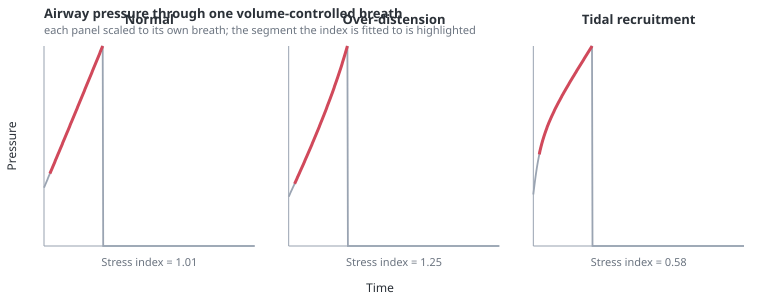

# The stress index

> The shape of the airway pressure curve during a passive constant-flow breath. Upward or downward curvature can suggest falling or improving compliance during inspiration; under the model's restricted conditions, these correspond to distension and recruitment.

---

## Physiology

During volume control with a constant inspiratory flow, volume rises linearly with time. If compliance were constant, airway pressure would rise linearly too. It usually does not, and the direction it bends says which way compliance is moving:

$$
P_{aw}(t) = a\,t^{\,b} + c
$$

- $P_{aw}$ — airway pressure during inspiration, cmH₂O
- $t$ — time from the start of inspiration, s
- $b$ — the **stress index**, dimensionless
- $a$, $c$ — scale and offset, fitted with it

$b > 1$ — pressure rises faster than linearly. Compliance is falling as the breath proceeds: the lung is being pushed onto the flat upper part of its [pressure–volume curve](pressure-volume-curve.md). This is tidal overdistension.

$b \approx 1$ — compliance is constant through the breath. Conventionally the target.

$b < 1$ — pressure rises more slowly than linearly. Compliance is *improving* as the breath proceeds; intratidal recruitment is one important cause. At the bedside this does not, by itself, prescribe a higher PEEP.

The index requires constant flow and a passive patient. Any effort during inspiration deforms the curve for reasons that have nothing to do with the tissue, and pressure control makes the question meaningless because flow is not constant.

---

## In the model

Airway pressure is sampled through each constant-flow inspiration and fitted once per breath, at the moment the breath ends.

The fit is a grid search over the exponent with a linear least-squares solve inside it. For each of 101 candidate exponents between 0.4 and 2.2, the model substitutes $x = t^b$, solves the resulting linear regression for $a$ and $c$ in closed form, and keeps the exponent with the smallest residual. There is no iterative optimiser and no derivative.

The first tenth of the samples is dropped as a fixed implementation choice to reduce the influence of the onset transient and resistive pressure step. Bedside protocols may define the fitted interval differently.

The cost is about a hundred small regressions over roughly forty samples, once per breath — a few tens of microseconds against a breath containing thousands of integration steps. It is not measurable in the model's running time.

**The index is withheld rather than shown when it would not mean anything** — during pressure control, during spontaneous effort, or when there are too few samples. This is the [interpretability](interpretability.md) machinery: a number whose validity conditions are not met is not displayed with a caveat, it is not displayed.

### Reading it at the bedside

The index is estimated from the ventilator's own airway pressure trace, and it is usually read by eye rather than fitted — the published work finds that visual inspection of the waveform agrees well with computation.

Each panel is one breath in this model, scaled to its own pressure range, with the segment the index is fitted to highlighted. The measured indices are the model's own.

Three things about the trace matter for reading it.

**The step at the onset does not belong to the fit.** Airway pressure jumps the moment flow starts, by $\dot{V}R_{aw}$. That step is resistive and carries nothing about the tissue, which is why the first tenth of the samples is discarded. Including it biases the exponent downward and can make a distending lung look linear.

**The ramp is the reading.** Between the step and the end of inspiration, volume rises linearly in time, so the shape of the pressure curve is the shape of the elastance. What the eye compares is that segment against a straight line through its ends.

**Constant flow is a precondition, not a detail.** In pressure control, flow decays through inspiration by design, so the pressure curve is flat by construction and its shape says nothing about the lung. The same is true of any breath with patient effort. The model withholds the index in both cases rather than printing a number that would be read as though it meant something.

The panels are scaled independently, and that is not a presentational convenience. On a shared absolute axis the distending breath rises by 63 cmH₂O and the recruiting one by 10, so the smaller curvature occupies about a hundredth of the plot and disappears. Measured as deviation from a straight line at mid-inspiration, as a fraction of each breath's own rise, the recruiting case bows **+8.6%** above the line and the distending case **−16.0%** below it. Both are real; one is an order of magnitude easier to see. In absolute terms the recruiting bow is 0.85 cmH₂O on a 9.9 cmH₂O rise, which is a fair statement of how hard an index below 1 is to spot at the bedside.

### What the model shows

| | stress index | plateau | driving pressure | measured Crs |
|---|---|---|---|---|
| normal, 500 mL | 1.03 | 13.8 cmH₂O | 5.8 | 87 mL/cmH₂O |
| stiff lung, 700 mL | **1.80** | 71.4 | 63.4 | 11 |
| stiff lung, 350 mL | 1.23 | 29.5 | 21.5 | 16 |
| recruiting lung | **0.72** | 16.0 | 10.0 | 60 |

The normal lung sits at 1.03 — close to linear, which is what a lung operating in the middle of its curve should give. The stiff lung ventilated at 700 mL reaches 1.80, unambiguous distension. Reducing that same lung to 350 mL brings it to 1.23: better, and still not linear.

The last row is the one the feature was added for. A lung that is recruiting during inspiration gives 0.72 — pressure rising *more slowly* than linearly. Before the tissue curve acquired its ceiling and recruitment became mechanical, this model produced a straight line in every condition, and the index could only ever have been 1.

---

## Why this and not something else

**Fitting the published form rather than reporting a curvature.** The second derivative of the pressure trace would be cheaper and would carry the same sign information. The power-law fit is used because the stress index is a *named quantity with a literature*, and reporting a differently-computed number under that name would be the category error this model works hardest to avoid.

**A grid search rather than an optimiser.** The exponent is one-dimensional and bounded, and the inner problem is linear given the exponent. A hundred exact solves are more robust than a nonlinear fit that can fail to converge, and cannot land in a local minimum. Robustness matters more than elegance for something computed unattended, thousands of times, across a whole control space.

**Fitting once per breath rather than continuously.** A rolling fit would produce a number that changes within the breath, which is not what the index is.

**Why the model could not do this before.** The stress index needs a lung whose compliance changes within a breath. With a linear tissue curve and a fixed open fraction, nothing changed, so airway pressure rose in a straight line at any tidal volume and any compliance — including exactly the condition where a clinician would look for the index. Adding it required the [saturating ceiling](pressure-volume-curve.md) and [recruitment that changes the mechanics](recruitment-and-ri.md). The feature is a readout of those, not a mechanism of its own.

---

## Limits

### Of the construction

- **No time dependence in the tissue**, so the model has no stress relaxation and no viscoelastic contribution to the curve's shape. A real trace contains both, and they bend it in ways the model attributes entirely to elastance.
- **Constant airway resistance.** Flow-dependent resistance would curve the trace on its own; here it cannot.
- **One compartment**, so no contribution from regions filling with different time constants.
- The fit range is 0.4 to 2.2, so an extreme value is clipped rather than reported.
- **There is no inspiratory pause.** Volume control delivers constant flow for the whole of the set inspiratory time, so the trace has no plateau phase; the plateau pressure the model reports is computed as alveolar pressure with the resistive term removed, not measured during a hold. The stress index itself is read from the ramp, but the figure is not the shape a ventilator with a pause would draw.
- The first-tenth exclusion is a fixed fraction, not an automatic detection of when flow has stabilised.

### Of clinical application

- **The model's index is computed from a clean pressure trace.** A bedside trace contains cardiac oscillation, circuit compliance, trigger artefacts and noise; whether a real index of 1.23 is distinguishable from 1.03 in a given patient is a question about the measurement, not about the physiology.
- **The index is not a PEEP or tidal volume setting.** It reports the direction of a problem, and the model deliberately does not convert it into an instruction.
- A value below 1 does not always mean "raise PEEP": in this model it can only arise from intratidal recruitment, whereas at the bedside it can also arise from a leak or from flow that is not truly constant.
- The validity conditions are enforced here and are not enforced at the bedside. The commonest way to be misled by a stress index is to read one during spontaneous effort, and the model shows nothing in that case.

---

## References

- Ranieri VM, Zhang H, Mascia L, et al. Pressure–time curve predicts minimally injurious ventilatory strategy in an isolated rat lung model. *Anesthesiology* 2000;93:1320–8.
- Grasso S, Terragni P, Mascia L, et al. Airway pressure–time curve profile (stress index) detects tidal recruitment/hyperinflation in experimental acute lung injury. *Crit Care Med* 2004;32:1018–27.
- Terragni PP, Filippini C, Slutsky AS, et al. Accuracy of plateau pressure and stress index to identify injurious ventilation in patients with acute respiratory distress syndrome. *Anesthesiology* 2013;119:880–9.
- Sun X-M, Chen G-Q, Zhou Y-M, et al. Stress index can be accurately and reliably assessed by visually inspecting ventilator waveforms. *Respir Care* 2018;63:1094–101.

---

## See also

[Pressure–volume curve](pressure-volume-curve.md) · [Equation of motion](equation-of-motion.md) · [Recruitment and R/I](recruitment-and-ri.md) · [Hysteresis](hysteresis.md) · [Interpretability](interpretability.md) · [Numeric tiles](numeric-tiles.md) · [Controls: ventilation](controls-ventilation.md)
