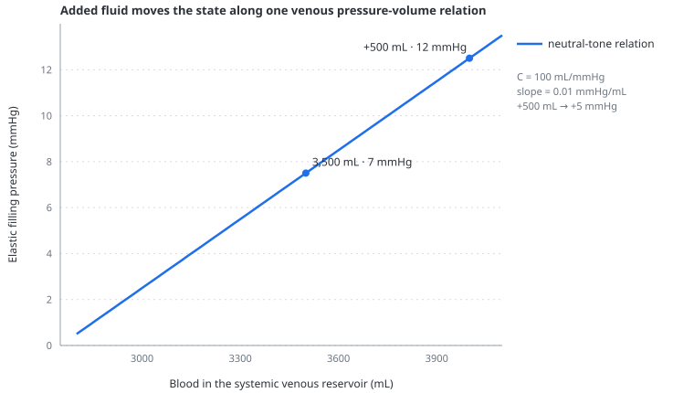

# Stressed volume

> Stressed volume is the part of vascular volume that stretches the vessel wall and generates elastic recoil; it is not a synonym for total blood volume, venous capacitance or fluid responsiveness.

---

## Physiology

Most blood sits in the systemic veins, which can accept a large change in volume for a small change in pressure. The first part of that volume fills the vascular space without generating appreciable transmural pressure and is called **unstressed volume**. Volume above that point distends the wall and is called **stressed volume**.

The distinction is functional rather than anatomical. A millilitre is not permanently labelled stressed or unstressed: venoconstriction can reduce vascular capacity and convert part of the existing reservoir into pressure-generating volume, while venodilatation does the reverse.

If flow stopped and pressures equilibrated, stressed volume and vascular compliance would determine the elastic component of [mean systemic filling pressure](venous-return.md):

$$
P_{msf,elastic} = \frac{V_s}{C_v}
$$

- $P_{msf,elastic}$ — elastic component of mean systemic filling pressure, mmHg
- $V_s$ — systemic venous stressed volume, mL
- $C_v$ — systemic venous compliance, mL/mmHg

This equation separates three interventions that are often blurred together. Adding fluid increases the amount of blood in the circulation. Venoconstriction shifts existing blood from the unstressed to the stressed part. Reducing compliance makes the same stressed volume generate more pressure. Their pressure effects can resemble one another, but their mechanisms and clinical consequences do not.

The relation is held fixed while 500 mL is added to the reservoir: the point moves from 3,500 mL and 7 mmHg to 4,000 mL and 12 mmHg. The compliance is 100 mL/mmHg; because pressure is on the vertical axis, the visible slope is its inverse, 0.01 mmHg/mL. This straight line is the model's deliberately simple reservoir, not a claim that the human venous pressure-volume relation is perfectly linear.

### Stressed volume is not fluid responsiveness

A rise in stressed volume usually raises the pressure available to drive venous return, but cardiac output rises only if the heart can use the additional filling. On the plateau of the model RV-function curve, extra stressed volume mainly raises right-sided filling pressure. The separate [preload reserve](preload-reserve.md) readout asks whether filling is likely to buy predicted steady flow, but does not independently test LV reserve.

---

## In the model

`Baseline stressed volume` is an actual-volume control. Moving it by 500 mL immediately adds or removes 500 mL from the systemic venous reservoir and therefore changes total model blood volume by the same amount. Subsequent circulation redistributes some of that blood among compartments, so the settled stressed-volume readout need not differ by exactly 500 mL.

At neutral tone the systemic venous zero-pressure volume is 2,800 mL. The default selected stressed volume is 700 mL and the default venous compliance is 100 mL/mmHg. These are aggregate teaching values for one reservoir, not estimates of a patient's total unstressed or stressed volume.

The model calculates the reservoir's current partition as:

$$
V_s = V_{sv} - \left(V_{u,0} - V_{tone}\right)
$$

- $V_s$ — current systemic venous stressed volume, mL
- $V_{sv}$ — blood physically present in the systemic venous compartment, mL
- $V_{u,0}$ — neutral-tone zero-pressure volume, fixed at 2,800 mL
- $V_{tone}$ — volume mobilised by [venous tone](venous-tone.md), mL

[Abdominal pressure](abdominal-pressure.md) contributes separately to mean systemic filling pressure when the splanchnic reservoir is sufficiently distended. Consequently, the displayed Pmsf is not always equal to stressed volume divided by compliance.

---

## Why this and not something else

An earlier model could have represented a fluid bolus by changing venous compliance or by raising venous pressure directly. Either choice would conceal the central distinction: fluid changes volume, tone changes capacity, and compliance changes the slope relating them. Keeping the three controls independent makes the effect of each intervention traceable.

The control is instantaneous because the intended lesson is the new haemodynamic equilibrium. Modelling infusion rate, distribution between vascular beds, transcapillary escape and renal handling would add respiratory and renal physiology without clarifying the immediate heart–lung interaction.

---

## Limits

### Of the construction

- There is one systemic venous reservoir rather than separate splanchnic, muscular, cutaneous and renal capacitance beds.
- The venous pressure-volume relation is linear above one zero-pressure volume; real veins recruit, change shape and become progressively less compliant.
- There is no stress relaxation, transcapillary fluid shift, glycocalyx, interstitial compartment or time-dependent distribution after a bolus.
- The baseline stressed-volume control adds blood directly to the reservoir; it is not a simulated crystalloid, colloid or transfusion.
- The numerical partition is exact inside the model but cannot be measured directly at the bedside.

### Of clinical application

- A high Pmsf or stressed volume does not prove adequate organ perfusion and is not a resuscitation target.
- A low stressed volume does not by itself establish that fluid will raise cardiac output; ventricular reserve and resistance to venous return still matter.
- The displayed volumes should not be compared directly with patient estimates obtained from analogue formulae or inspiratory-hold extrapolation.

---

## Validation

Executable checks require fluid to change actual blood volume one-for-one, venous tone to preserve total blood while shifting the stressed/unstressed partition, and venous compliance to change pressure without reclassifying volume. The [scenario audit](../docs/SCENARIO_VALIDATION.md) separately verifies that the septic phenotype responds to added stressed volume while autonomic compensation remains distinguishable.

---

## References

- Guyton AC, Lindsey AW, Kaufmann BN. Effect of mean circulatory filling pressure and other peripheral circulatory factors on cardiac output. *Am J Physiol*. 1955;180:463–468. [doi:10.1152/ajplegacy.1955.180.3.463](https://doi.org/10.1152/ajplegacy.1955.180.3.463)
- Rothe CF. Venous system: physiology of the capacitance vessels. *Physiol Rev*. 1983;63:1281–1342. [doi:10.1152/physrev.1983.63.4.1281](https://doi.org/10.1152/physrev.1983.63.4.1281)
- Maas JJ, Geerts BF, van den Berg PCM, Pinsky MR, Jansen JRC. Assessment of venous return curve and mean systemic filling pressure in postoperative cardiac surgery patients. *Crit Care Med*. 2009;37:912–918. [doi:10.1097/CCM.0b013e3181961481](https://doi.org/10.1097/CCM.0b013e3181961481)
- Magder S. Volume and its relationship to cardiac output and venous return. *Crit Care*. 2016;20:271. [doi:10.1186/s13054-016-1438-7](https://doi.org/10.1186/s13054-016-1438-7)
- Persichini R, Lai C, Teboul JL, et al. Venous return and mean systemic filling pressure: physiology and clinical applications. *Crit Care*. 2022;26:150. [doi:10.1186/s13054-022-04024-x](https://doi.org/10.1186/s13054-022-04024-x)

---

## See also

[Venous return](venous-return.md) · [Venous tone](venous-tone.md) · [Preload reserve](preload-reserve.md) · [Abdominal pressure](abdominal-pressure.md) · [Controls: volume](controls-volume.md)
