# Venous return

> Flow back to the heart is driven by the difference between the pressure filling the venous reservoir and the pressure in the right atrium. Cardiac output settles where venous return and cardiac function are equal; neither curve determines it alone.

---

## Physiology

The systemic circulation holds most of its blood on the venous side, at low pressure. If the heart were stopped, pressures would equalise at a value set by the blood volume and the compliance of the vessels holding it: the **mean systemic filling pressure**, around 7–10 mmHg. That pressure is the upstream head for the return of blood to the chest.

Flow back to the right atrium is then:

$$
\dot{Q}_{vr} = \frac{P_{msf} - P_{ra}}{R_{vr}}
$$

- $\dot{Q}_{vr}$ — venous return, L/min
- $P_{msf}$ — mean systemic filling pressure, mmHg: the pressure the venous reservoir would settle at if flow stopped
- $P_{ra}$ — right atrial pressure, mmHg
- $R_{vr}$ — resistance to venous return, mmHg·min/L

Two features of this expression carry most of the clinical content.

**The driving gradient is small.** A few millimetres of mercury separate the reservoir from the right atrium. A change in right atrial pressure that would be trivial on the arterial side — 3 mmHg — is a large fraction of this gradient. Anything that raises right atrial pressure, including [pleural pressure](pleural-pressure.md) transmitted from a ventilator, therefore cuts venous return substantially.

**Raising right atrial pressure reduces flow.** This is the sense in which "the heart limits its own filling". A ventricle that fails and backs up raises the pressure it must fill against.

### The Guyton construction

Two relations run in opposite directions against the same variable. Venous return **falls** as right atrial pressure rises. Cardiac output **rises** as right atrial pressure rises, because a fuller ventricle ejects more. Plotted together, they cross at one point, and the circulation must operate there — that is the only pressure at which what returns equals what is ejected.



The construction earns its place because it separates two questions that a single cardiac output number confuses. Fluid responsiveness is primarily determined by where the operating point lies on the **cardiac function curve**: on its ascending limb, additional filling can raise output; on its plateau, additional filling mainly raises filling pressure. Giving volume also shifts the venous return curve to the right by raising mean systemic filling pressure, and the new output is the intersection of both relations — see [preload reserve](preload-reserve.md).

This must not be confused with the **plateau of the venous return curve** at very low right atrial pressure. That plateau reflects collapse of the great veins and limits the maximum venous return; it is not the flat limb of the Frank–Starling relation.

It also shows why PEEP costs output. Raising PEEP shifts the cardiac function curve rightward, because the ventricle now sits inside a higher surrounding pressure and needs a higher measured atrial pressure to reach the same transmural filling. The crossing moves to a lower flow at a higher right atrial pressure — exactly the pattern in [transmural pressure](transmural-pressure.md), seen graphically.

### The venous-return plateau is not a Frank–Starling phenomenon

The plateau of the venous return curve is often attributed to the heart. It is not: it is the great veins collapsing as the pressure inside them falls below the pressure outside. That mechanism has its own page — see [vascular waterfalls](vascular-waterfalls.md).

---

## In the model

Venous return has **one definition**, used by both the integrator and the drawn curve:

```
venousReturnFlow(pmsf, pra, pCrit, rvr)
```

This matters more than it sounds. When the plot computed the curve independently, the two drifted apart, and the diagram showed a construction the model was not obeying. The panel and the integrator now call the same function, so the curve cannot lie about the model.

Mean systemic filling pressure comes from the [stressed volume](stressed-volume.md) of the venous reservoir divided by its compliance, plus the [abdominal](abdominal-pressure.md) contribution where the reservoir is distended enough to have one.

### The two marks on the diagram

The panel draws two things that are easy to conflate, and deliberately distinguishes them:

- **the simulated point** — where the integrated model actually is: cycle-mean right atrial pressure against cycle-mean flow;
- **the equilibrium point** — where the graphical analysis says it should be: the crossing of the two curves.

They are close but not identical, because the Guyton construction is a steady-state analysis being applied to a circulation that is never quite in steady state: compliant compartments are still filling and emptying within each breath. Showing only the crossing would present an idealisation as the model's answer. Both marks are shown so the size of that idealisation is visible.

Everything on the diagram is a cycle mean. An earlier version plotted instantaneous right atrial pressure against a beat-averaged output — two quantities measured over different windows — and the marker skidded across a third of the axis at heart rate while barely moving vertically.

### What the model shows

A passive patient at 500 mL, 14 breaths per minute:

<!-- BEGIN GENERATED: venous-return-peep -->
*Executable setup: passive volume control, VT 500 mL, 14/min; each PEEP level is settled for 45 s. Right atrial pressure is the respiratory-cycle mean used by the Guyton construction.*

| PEEP (cmH₂O) | P<sub>msf</sub> (mmHg) | mean P<sub>ra</sub> (mmHg) | cardiac output (L/min) |
|---:|---:|---:|---:|
| 0 | 7.0 | -0.6 | 4.94 |
| 5 | 8.6 | 0.9 | 4.93 |
| 10 | 9.7 | 2.2 | 4.75 |
| 15 | 10.8 | 3.5 | 4.44 |
| 20 | 11.9 | 4.9 | 4.23 |
<!-- END GENERATED: venous-return-peep -->

Mean systemic filling pressure *rises* with PEEP — the abdominal contribution and the compression of the reservoir see to that — and output falls anyway, because right atrial pressure rises faster than the head does. The gradient is what matters, not either end of it.

---

## Why this and not something else

The model integrates a closed loop and *derives* the Guyton diagram from it, rather than using the diagram as the model. A pure Guyton model — two straight lines and their intersection — is a fine teaching device but cannot show the breath-by-breath behaviour, cannot produce a pulse pressure, and cannot be wrong in an interesting way. Here the curves are constructed from the same state variables the integrator advances, so a discrepancy between the crossing and the simulated point is information rather than an error.

Venous return uses a soft collapse law rather than a hard `max()`, for reasons given under [vascular waterfalls](vascular-waterfalls.md).

The resistance to venous return is a single control. Splitting it into the several parallel beds that a real circulation drains through — with their own compliances and time constants — would be more faithful and would make the reservoir's response to a fluid bolus time-dependent. It was not done: one reservoir keeps volume conservation checkable and keeps the diagram legible, which is what the construction is for.

---

## Limits

### Of the construction

- **One venous reservoir.** No splanchnic, cutaneous or muscular capacitance beds, and therefore no redistribution between fast and slow compartments. A fluid bolus arrives instantaneously in one place.
- **No stress relaxation, no transcapillary escape, no distribution kinetics.** Volume added stays where it is put.
- **The resistance to venous return is a constant** apart from the abdominal term. It does not vary with flow, tone or vessel calibre.
- **The Guyton diagram is a steady-state construction** applied to a non-steady state. The gap between the two marks is the size of that assumption, and it grows with the size of the respiratory swing.
- Mean systemic filling pressure here is computed from the model's own state. It is an internal quantity, not the thing an occlusion manoeuvre measures — see [Pmsf and occlusions](pmsf-and-occlusions.md).

### Of clinical application

- **No number on this diagram is a target.** The construction shows the shape of a patient's reserve, not a value to resuscitate towards.
- The model's mean systemic filling pressure is exact and always available. At the bedside it is not measurable without a manoeuvre whose own assumptions are questionable, and the model deliberately shows how far that manoeuvre's estimate can sit from the truth.
- Preload responsiveness in this model is a movement along its own curves in response to its own stressed-volume control. That is not the same as a patient's response to 500 mL of crystalloid, which redistributes.

---

## References

- Guyton AC, Lindsey AW, Kaufmann BN. Effect of mean circulatory filling pressure and other peripheral circulatory factors on cardiac output. *Am J Physiol* 1955;180:463–8.
- Guyton AC, Lindsey AW, Abernathy B, Richardson T. Venous return at various right atrial pressures and the normal venous return curve. *Am J Physiol* 1957;189:609–15.
- Magder S. Volume and its relationship to cardiac output and venous return. *Crit Care* 2016;20:271.
- Berger D, Moller PW, Weber A, et al. Effect of PEEP and inspiratory hold on mean systemic filling pressure. *Am J Physiol Heart Circ Physiol* 2016;311:H794–H806.
- Henderson WR, Griesdale DEG, Walley KR, Sheel AW. Clinical review: Guyton — the role of mean circulatory filling pressure and right atrial pressure in controlling cardiac output. *Crit Care* 2010;14:243.

---

## See also

[Transmural pressure](transmural-pressure.md) · [Vascular waterfalls](vascular-waterfalls.md) · [Stressed volume](stressed-volume.md) · [Venous tone](venous-tone.md) · [Abdominal pressure](abdominal-pressure.md) · [Preload reserve](preload-reserve.md) · [Pmsf and occlusions](pmsf-and-occlusions.md) · [The Guyton panel](panel-guyton.md)
