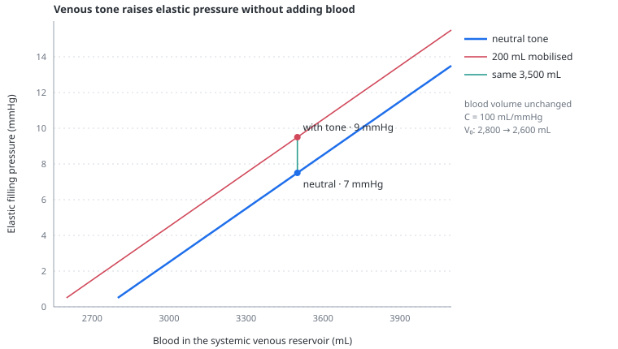

# Venous tone

> Venoconstriction can raise the pressure driving venous return by mobilising blood that was already in the venous reservoir; it does not need to add fluid or change venous compliance.

---

## Physiology

The systemic veins are the circulation's main capacitance reservoir. Sympathetic venoconstriction reduces that capacity. At the same total blood volume, less volume can remain unstressed, so more of the reservoir distends the vascular wall and contributes to [mean systemic filling pressure](venous-return.md).

In pressure-volume terms, venoconstriction shifts the relation left. A fluid bolus instead moves the operating point rightward along a fixed relation. A change in venous compliance changes the pressure gained for a given added volume.

At the marked 3,500 mL reservoir volume, mobilising 200 mL lowers the zero-pressure volume from 2,800 to 2,600 mL and raises elastic filling pressure from 7 to 9 mmHg. The operating point moves vertically because no blood has been added. Both relations retain the same 100 mL/mmHg compliance; on these axes that corresponds to the same 0.01 mmHg/mL slope.

This is why norepinephrine can have a clinically useful “fluid-like” venous effect without being fluid. Human septic-shock studies show that changing norepinephrine modifies mean systemic pressure and the haemodynamic response to a reversible volume challenge. That does not make venous tone equivalent to volume expansion: norepinephrine simultaneously alters arterial resistance, cardiac loading and sometimes contractility.

---

## In the model

Venous tone is not an independent drug control. It is one of four effectors driven together by the aggregate [baroreflex](baroreflex.md). Positive reflex outflow lowers the zero-pressure volume of the systemic venous reservoir:

$$
V_{tone} = 200\,S
$$

- $V_{tone}$ — volume shifted from unstressed to stressed, mL
- $S$ — aggregate sympathetic outflow, dimensionless, bounded between −0.25 and 1
- $200$ — maximum positive mobilisation, mL; a didactic shape coefficient rather than a human dose-response estimate

Total blood volume and selected venous compliance remain unchanged. At full positive outflow, 200 mL is reclassified as stressed; at maximum withdrawal, 50 mL moves in the opposite direction.

In the shipped septic phenotype, enabling the aggregate baroreflex raises output, arterial pressure and mean systemic filling pressure. Those changes are the composite result of simultaneous chronotropy, arterial constriction, venous mobilisation and inotropy; they do not isolate the venous contribution. The current executable comparison is shown on the [baroreflex](baroreflex.md) page rather than being copied into several pages.

---

## Why this and not something else

Changing venous compliance to represent tone would make constriction both shift and steepen the pressure-volume relation. That can occur in real vascular beds, but it would erase the didactically important difference between capacitance and compliance and would make a pressure rise impossible to attribute.

The model therefore uses the smallest mechanism that expresses the central principle: change the zero-pressure volume while leaving slope and total volume alone. A regional pharmacological model was rejected because different veins, organs and vasoactive drugs would require separate dose-response curves and redistribution time constants.

---

## Limits

### Of the construction

- All capacitance vessels respond as one reservoir; regional redistribution is absent.
- The 200 mL maximum is an internal calibration, not a universal sympathetic reserve and not a norepinephrine-equivalent dose.
- Tone changes only through the aggregate baroreflex and cannot be manipulated independently of its other effectors.
- Venous compliance is held fixed during tone changes, although real vascular pressure-volume relations can change shape.
- There is no venous drug kinetics, receptor pharmacology or delayed recruitment from splanchnic and cutaneous beds.

### Of clinical application

- The model cannot compare fluids with norepinephrine, vasopressin or other agents as therapies.
- A rise in Pmsf after venoconstriction may fail to raise flow if right atrial pressure or resistance to venous return rises with it.
- The amount labelled “mobilised” is exact only inside the model and is not a bedside measurement.

---

## Validation

Executable tests require positive tone to lower unstressed volume and raise stressed volume by the same amount while preserving reservoir volume and compliance. The reflex tests additionally require the pressure defence to retain mechanistic preload dependence rather than hiding it behind MAP.

---

## References

- Rothe CF. Venous system: physiology of the capacitance vessels. *Physiol Rev*. 1983;63:1281–1342. [doi:10.1152/physrev.1983.63.4.1281](https://doi.org/10.1152/physrev.1983.63.4.1281)
- Persichini R, Silva S, Teboul JL, et al. Effects of norepinephrine on mean systemic pressure and venous return in human septic shock. *Crit Care Med*. 2012;40:3146–3153. [doi:10.1097/CCM.0b013e318260c6c3](https://doi.org/10.1097/CCM.0b013e318260c6c3)
- Adda I, Lai C, Teboul JL, et al. Norepinephrine potentiates the efficacy of volume expansion on mean systemic pressure in septic shock. *Crit Care*. 2021;25:302. [doi:10.1186/s13054-021-03711-5](https://doi.org/10.1186/s13054-021-03711-5)
- Persichini R, Lai C, Teboul JL, et al. Venous return and mean systemic filling pressure: physiology and clinical applications. *Crit Care*. 2022;26:150. [doi:10.1186/s13054-022-04024-x](https://doi.org/10.1186/s13054-022-04024-x)

---

## See also

[Stressed volume](stressed-volume.md) · [Baroreflex](baroreflex.md) · [Venous return](venous-return.md) · [Controls: volume](controls-volume.md) · [Septic shock scenario](scenarios.md#septic-shock-fluid-responsive)
